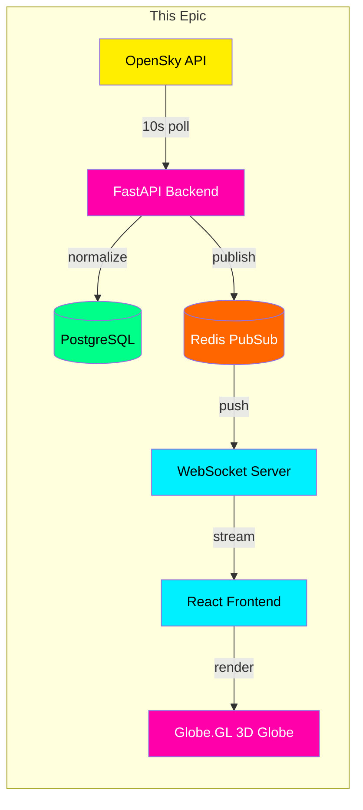
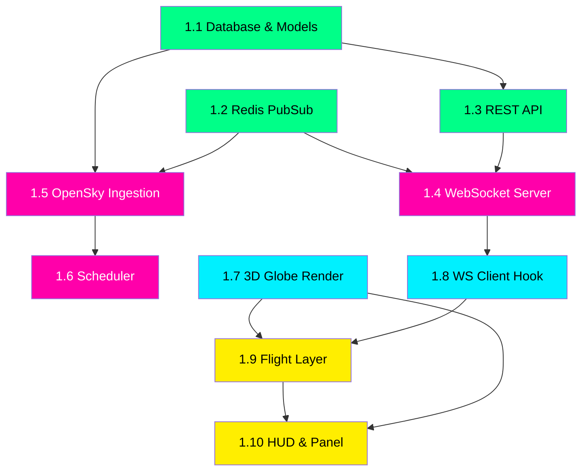

# NEXUS GLOBE — Epic 1: The Living Globe

### Foundation Sprint: 3D Globe + Real-Time Pipeline + Flight Tracking

---

## Epic Summary

**Goal:** Deliver a working cyberpunk 3D globe that connects to the backend via WebSocket and renders live flight data as the first intelligence layer. When this epic is done, a user opens the app and sees a dark, neon-lit globe slowly rotating with hundreds of yellow aircraft markers moving in real-time — the "wow moment" that proves the concept.

**Definition of Done:** User opens `localhost:5173`, sees a styled 3D globe, and within 10 seconds live aircraft positions appear and update every 10s without a page refresh.

---

## Architecture Context



---

## Stories

This epic contains **10 stories** split across backend and frontend, ordered by dependency (build in this sequence):

---

### STORY 1.1 — Database & Core Models
**Track:** Backend
**Points:** 3
**Priority:** P0 — Blocker

#### Description
Set up the PostgreSQL + PostGIS database with the unified events table and async SQLAlchemy engine. This is the data foundation everything else writes to and reads from.

#### Acceptance Criteria
- [ ] PostgreSQL container runs via docker-compose with PostGIS extension enabled
- [ ] SQLAlchemy async engine connects successfully on startup
- [ ] `events` table created with all columns from the architecture doc:
  - `id` (UUID, PK), `event_type`, `category`, `title`, `description`
  - `location` (Geography POINT, 4326), `altitude_m`, `heading_deg`, `speed_kmh`
  - `severity` (1-5), `source`, `source_url`, `source_id`
  - `metadata` (JSONB), `trail` (JSONB)
  - `created_at`, `updated_at`, `expires_at` (TIMESTAMPTZ)
- [ ] Geospatial index on `location`, composite index on `(event_type, created_at)`
- [ ] Unique constraint on `(source, source_id)` for deduplication
- [ ] Alembic initial migration generated and runs cleanly
- [ ] `get_db` async dependency yields sessions correctly
- [ ] Health check endpoint returns DB connection status

#### Technical Notes
```python
# database.py — core setup
from sqlalchemy.ext.asyncio import create_async_engine, AsyncSession
from sqlalchemy.orm import sessionmaker

engine = create_async_engine(settings.database_url, echo=False)
async_session = sessionmaker(engine, class_=AsyncSession, expire_on_commit=False)

async def get_db():
    async with async_session() as session:
        yield session
```

#### Files to Create/Modify
- `backend/app/db/database.py`
- `backend/app/models/event.py`
- `backend/app/models/schemas.py` (Pydantic: GlobeEventCreate, GlobeEventResponse)
- `backend/alembic/` (init + first migration)
- `docker-compose.yml` (postgres service)

---

### STORY 1.2 — Redis Setup & PubSub Manager
**Track:** Backend
**Points:** 2
**Priority:** P0 — Blocker

#### Description
Set up Redis as both a cache and a PubSub message bus. When new events are ingested, they get published to Redis channels. The WebSocket server subscribes to these channels and pushes to connected clients.

#### Acceptance Criteria
- [ ] Redis 7 container runs via docker-compose
- [ ] Async Redis client connects on app startup
- [ ] `publish_event(channel, event)` function sends serialized events to a channel
- [ ] `subscribe_channel(channel)` returns an async iterator of messages
- [ ] Channel naming convention: `layer:{event_type}` (e.g., `layer:flight`, `layer:news`)
- [ ] Health check includes Redis connection status
- [ ] Events cached in Redis with TTL matching their `expires_at`

#### Technical Notes
```python
# Channel naming
CHANNEL_PREFIX = "layer:"
# layer:flight, layer:news, layer:ship, etc.

# Publish pattern
await redis.publish(f"layer:{event.event_type}", event.model_dump_json())

# Cache pattern (for initial load)
await redis.setex(f"event:{event.id}", ttl_seconds, event.model_dump_json())
```

#### Files to Create/Modify
- `backend/app/db/redis.py` (new — Redis client + pub/sub helpers)
- `backend/app/main.py` (add Redis startup/shutdown)
- `docker-compose.yml` (redis service)

---

### STORY 1.3 — REST API Endpoints
**Track:** Backend
**Points:** 3
**Priority:** P0 — Blocker

#### Description
Implement the core REST API endpoints that the frontend uses for initial data loading and on-demand queries. These complement the WebSocket stream (which handles real-time pushes) by providing historical and filtered data on demand.

#### Acceptance Criteria
- [ ] `GET /api/health` — returns `{ status, db, redis, uptime }`
- [ ] `GET /api/events` — returns paginated events with filters:
  - `?type=flight,news` (comma-separated event types)
  - `?severity_min=3&severity_max=5`
  - `?bbox=sw_lat,sw_lng,ne_lat,ne_lng` (bounding box geospatial query)
  - `?since=2024-01-01T00:00:00Z` (time filter)
  - `?limit=100&offset=0`
- [ ] `GET /api/events/{id}` — returns single event with full metadata
- [ ] `GET /api/layers` — returns list of available layers with:
  - `{ type, label, color, source, status, event_count, last_updated }`
- [ ] All endpoints return proper JSON with consistent error format
- [ ] CORS configured for `localhost:5173`
- [ ] Response time < 200ms for typical queries

#### Technical Notes
```python
# Bounding box query with PostGIS
from geoalchemy2.functions import ST_MakeEnvelope, ST_Within

stmt = select(Event).where(
    ST_Within(
        Event.location,
        ST_MakeEnvelope(sw_lng, sw_lat, ne_lng, ne_lat, 4326)
    )
)
```

#### Files to Create/Modify
- `backend/app/api/routes.py`
- `backend/app/api/__init__.py` (create router)
- `backend/app/main.py` (include router)

---

### STORY 1.4 — WebSocket Server
**Track:** Backend
**Points:** 5
**Priority:** P0 — Blocker

#### Description
Implement the WebSocket endpoint that clients connect to for real-time event streaming. Clients send subscription messages to choose which layers they want, and the server pushes events from those layers via Redis PubSub.

#### Acceptance Criteria
- [ ] WebSocket endpoint at `ws://localhost:8000/ws`
- [ ] `ConnectionManager` class tracks active connections
- [ ] Client can subscribe/unsubscribe to specific layer channels:
  ```json
  { "action": "subscribe", "layers": ["flight", "news"] }
  { "action": "unsubscribe", "layers": ["flight"] }
  ```
- [ ] Server pushes new events only for subscribed layers:
  ```json
  { "type": "event_update", "data": { ...GlobeEvent } }
  { "type": "event_batch", "data": [ ...GlobeEvent[] ] }
  { "type": "event_remove", "data": { "id": "..." } }
  ```
- [ ] On connect, server sends current snapshot of active events for subscribed layers
- [ ] Handles client disconnect gracefully (cleanup subscriptions)
- [ ] Supports 50+ concurrent connections without degradation
- [ ] Heartbeat ping every 30s to keep connections alive

#### Technical Notes
```python
# WebSocket message protocol
class WSMessage(BaseModel):
    action: Literal["subscribe", "unsubscribe", "get_detail"]
    layers: list[str] | None = None
    event_id: str | None = None

class WSPush(BaseModel):
    type: Literal["event_update", "event_batch", "event_remove", "snapshot"]
    data: dict | list
```

#### Files to Create/Modify
- `backend/app/api/websocket.py`
- `backend/app/main.py` (register WS route)

---

### STORY 1.5 — OpenSky Flight Ingestion Service
**Track:** Backend
**Points:** 5
**Priority:** P1 — Core Feature

#### Description
Implement the first live data ingestion service — OpenSky Network for real-time flight tracking. This polls the OpenSky API every 10 seconds, normalizes the aircraft state vectors into GlobeEvents, deduplicates them, stores in PostgreSQL, and publishes to Redis for WebSocket distribution.

#### Acceptance Criteria
- [ ] `OpenSkyService` extends `BaseIngestionService`
- [ ] Fetches from `https://opensky-network.org/api/states/all` via httpx
- [ ] Parses state vectors into GlobeEvent objects:
  - `event_type`: "flight"
  - `title`: callsign or "Unknown Aircraft"
  - `latitude/longitude`: from position report
  - `altitude`: geometric altitude in meters
  - `heading`: true track in degrees
  - `speed`: velocity in km/h (converted from m/s)
  - `severity`: 1 (normal), 2 if military (based on callsign patterns)
  - `source_id`: ICAO24 transponder address
  - `metadata`: `{ icao24, callsign, origin_country, on_ground, squawk }`
  - `trail`: append last 10 positions for path rendering
  - `expires_at`: 60 seconds from now (auto-cleanup if aircraft disappears)
- [ ] Handles API rate limits gracefully (anonymous: 10s between calls)
- [ ] Supports optional authentication for higher rate limits
- [ ] Filters out on-ground aircraft (optional, configurable)
- [ ] Deduplicates by ICAO24 address (upsert, not duplicate insert)
- [ ] Publishes each new/updated flight to `layer:flight` Redis channel
- [ ] Logs ingestion stats: `"OpenSky: ingested 4832 flights in 1.2s"`
- [ ] Handles API downtime gracefully (retry with backoff)

#### Technical Notes
```python
# OpenSky state vector fields (positions in response array):
# 0: icao24, 1: callsign, 2: origin_country, 3: time_position
# 4: last_contact, 5: longitude, 6: latitude, 7: baro_altitude
# 8: on_ground, 9: velocity, 10: true_track, 11: vertical_rate
# 12: sensors, 13: geo_altitude, 14: squawk, 15: spi, 16: position_source

OPENSKY_URL = "https://opensky-network.org/api/states/all"
```

#### Files to Create/Modify
- `backend/app/services/ingestion/opensky.py`
- `backend/app/services/ingestion/base.py` (finalize abstract class)
- `backend/app/services/dedup.py` (upsert logic)
- `backend/app/scheduler.py` (register OpenSky with 10s interval)

---

### STORY 1.6 — APScheduler Polling Engine
**Track:** Backend
**Points:** 2
**Priority:** P1 — Core Feature

#### Description
Set up the APScheduler-based polling engine that runs ingestion services at their configured intervals. For this epic it only runs OpenSky, but the design must support adding more services in later epics without code changes to the scheduler itself.

#### Acceptance Criteria
- [ ] APScheduler starts on FastAPI startup event
- [ ] Registers `OpenSkyService.ingest()` as an async job with 10s interval
- [ ] Scheduler is configurable — each service declares its own `poll_interval_seconds`
- [ ] Service registry pattern: add a service to a list and it auto-registers
- [ ] Logs each poll cycle: `"Scheduler: running opensky (interval: 10s)"`
- [ ] Handles job failures without crashing the scheduler
- [ ] Graceful shutdown on app teardown

#### Technical Notes
```python
# Service registry pattern
SERVICES = [
    OpenSkyService(),
    # Future: USGSService(), GDELTService(), etc.
]

for service in SERVICES:
    scheduler.add_job(
        service.ingest,
        'interval',
        seconds=service.poll_interval_seconds,
        id=service.source_name,
        replace_existing=True
    )
```

#### Files to Create/Modify
- `backend/app/scheduler.py`
- `backend/app/main.py` (start/stop scheduler in lifespan)

---

### STORY 1.7 — 3D Globe Rendering with Cyberpunk Theme
**Track:** Frontend
**Points:** 8
**Priority:** P0 — Blocker (this IS the product)

#### Description
Implement the core 3D globe using Globe.GL with a dark cyberpunk aesthetic. This is the visual foundation of the entire app — a slowly auto-rotating earth with a dark texture, neon country borders, atmospheric glow, and a star field background. No data layers yet, just a stunning globe.

#### Acceptance Criteria
- [ ] Globe.GL instance renders in full-screen container
- [ ] Dark earth texture (night-lights satellite imagery or custom dark style)
- [ ] Country polygons with thin neon-cyan border lines
- [ ] Atmospheric glow effect (blue/cyan haze around globe edges)
- [ ] Star field background (Three.js particle system or static texture)
- [ ] Slow auto-rotation (0.1 deg/s) that pauses when user interacts
- [ ] Smooth mouse controls: drag to rotate, scroll to zoom, right-drag to pan
- [ ] Globe starts centered on user's approximate region (or default to Atlantic view)
- [ ] Responsive — fills viewport on resize
- [ ] Maintains 60 FPS with no data layers active
- [ ] Scanline overlay effect rendered on top (CSS pseudo-element)
- [ ] Loading state: pulsing "INITIALIZING..." text in Orbitron font

#### Visual Reference
```
┌──────────────────────────────────────────────────┐
│ ★  ·    ·  ★         ·    ★    ·       ★    ·   │
│    ·         ★    ·         ·      ★         ·   │
│        ·          ╭────────────╮         ★       │
│  ★         ·     ╱  ░░░░░░░░░░ ╲    ·            │
│    ·           ╱ ░░▓▓░░░░░▓▓░░░ ╲        ·  ★   │
│         ★    │ ░░▓▓▓▓░░░▓▓▓▓░░░░ │   ·          │
│   ·          │ ░░░▓▓░░░░░▓▓░░░░░ │       ★      │
│     ·    ★    ╲ ░░░░░░░░░░░░░░ ╱         ·      │
│  ★         ·   ╲  ░░░░░░░░░░ ╱    ·    ★        │
│    ·              ╰────────────╯        ·     ·   │
│         ★    ·          ·    ★    ·         ★    │
│   ·              ★         ·         ★    ·      │
│ ────────────── SCANLINE OVERLAY ──────────────── │
└──────────────────────────────────────────────────┘
       Dark globe, neon borders, star field
```

#### Technical Notes
```typescript
import Globe from 'globe.gl';

const globe = Globe()
  .globeImageUrl('/textures/earth-dark.jpg')      // NASA night lights
  .backgroundImageUrl('/textures/night-sky.png')   // star field
  .polygonsData(countries.features)                 // GeoJSON borders
  .polygonStrokeColor(() => '#00f0ff')              // neon cyan borders
  .polygonSideColor(() => 'rgba(0,240,255,0.05)')
  .polygonCapColor(() => 'rgba(0,0,0,0)')
  .atmosphereColor('#00f0ff')
  .atmosphereAltitude(0.25)
  .pointOfView({ lat: 30, lng: 0, altitude: 2.5 });
```

#### Assets Needed
- Dark earth texture (NASA Black Marble or similar, royalty-free)
- Star field background image
- GeoJSON country borders (Natural Earth low-res)

#### Files to Create/Modify
- `frontend/src/components/Globe/GlobeCanvas.tsx`
- `frontend/src/styles/cyberpunk.css` (theme + scanlines)
- `frontend/public/textures/` (earth + sky textures)
- `frontend/public/data/countries.geojson`
- `frontend/src/App.tsx` (layout)
- `frontend/src/App.css`

---

### STORY 1.8 — WebSocket Client Hook
**Track:** Frontend
**Points:** 3
**Priority:** P0 — Blocker

#### Description
Implement a React hook that manages the WebSocket connection to the backend, handles subscriptions to data layers, and pushes received events into the Zustand store. This is the real-time data pipeline from backend to globe.

#### Acceptance Criteria
- [ ] `useWebSocket` hook connects to `ws://localhost:8000/ws` on mount
- [ ] Auto-reconnects with exponential backoff on disconnect (1s, 2s, 4s, max 30s)
- [ ] Sends subscribe/unsubscribe messages when layer toggles change
- [ ] Parses incoming messages and calls `upsertEvents` on the Zustand store
- [ ] Handles message types: `event_update`, `event_batch`, `event_remove`, `snapshot`
- [ ] Connection status exposed: `connected`, `connecting`, `disconnected`
- [ ] Connection status displayed in HUD (green/red dot)
- [ ] Cleans up connection on unmount
- [ ] Handles malformed messages gracefully (log + skip)

#### Technical Notes
```typescript
// Hook interface
function useWebSocket(): {
  status: 'connected' | 'connecting' | 'disconnected';
  subscribe: (layers: string[]) => void;
  unsubscribe: (layers: string[]) => void;
  requestDetail: (eventId: string) => void;
}

// Auto-subscribe based on store
const { layers } = useGlobeStore();
useEffect(() => {
  const active = Object.entries(layers)
    .filter(([_, on]) => on)
    .map(([type]) => type);
  subscribe(active);
}, [layers]);
```

#### Files to Create/Modify
- `frontend/src/hooks/useWebSocket.ts`
- `frontend/src/stores/globeStore.ts` (finalize store actions)
- `frontend/src/types/events.ts` (WS message types)

---

### STORY 1.9 — Flight Layer Rendering
**Track:** Frontend
**Points:** 5
**Priority:** P1 — Core Feature

#### Description
Render live flight data from the Zustand store onto the Globe.GL instance as the first visual data layer. Aircraft should appear as small yellow arrow markers that point in their heading direction, with a fading trail showing their recent path.

#### Acceptance Criteria
- [ ] Flights render as custom point markers on the globe
- [ ] Marker shape: small arrow/chevron pointing in heading direction
- [ ] Color: neon yellow `#ffee00` with subtle glow
- [ ] Size scales with zoom level (smaller when zoomed out, larger when close)
- [ ] Trail: thin yellow line showing last 10 positions, fading at the tail
- [ ] Hover tooltip shows: callsign, altitude (ft), speed (kts), origin country
- [ ] Click opens detail in side panel (Story 1.10)
- [ ] Markers update position smoothly (interpolate between 10s updates, not jump)
- [ ] Layer toggleable via store — disappears when flights layer is off
- [ ] Performance: renders 5000+ simultaneous flights at 60 FPS
- [ ] On-ground aircraft shown as dimmed dots (50% opacity) or hidden (configurable)

#### Visual Reference
```
                    ╱▶ BA215 (35,000ft)
                   ╱
            ·····╱
     Trail ·····╱  heading arrow
              ╱
         ···╱  ▶ UAE12 (41,000ft)
```

#### Technical Notes
```typescript
// Globe.GL custom layer for flights
globe
  .customLayerData(flightEvents)
  .customThreeObject((d: GlobeEvent) => {
    // Create arrow mesh pointing in heading direction
    const arrow = new THREE.Mesh(arrowGeometry, neonYellowMaterial);
    arrow.rotation.z = -d.heading * (Math.PI / 180);
    return arrow;
  })
  .customThreeObjectUpdate((obj, d: GlobeEvent) => {
    // Smoothly lerp position on each update
    Object.assign(obj.__data, d);
    obj.rotation.z = -d.heading * (Math.PI / 180);
  });
```

#### Files to Create/Modify
- `frontend/src/components/Globe/layers/FlightLayer.tsx`
- `frontend/src/components/Globe/GlobeCanvas.tsx` (integrate layer)

---

### STORY 1.10 — HUD Overlay & Event Panel (Minimal)
**Track:** Frontend
**Points:** 5
**Priority:** P1 — Core Feature

#### Description
Build the initial HUD (Heads-Up Display) overlay and a minimal side panel that shows event details when a flight marker is clicked. This brings the cyberpunk aesthetic to life with scanlines, neon text, and glowing panels.

#### Acceptance Criteria

**HUD Overlay:**
- [ ] Top-left: "NEXUS GLOBE" title in Orbitron font with neon cyan glow
- [ ] Top-left below title: current UTC time, updating every second
- [ ] Top-right: connection status indicator (green dot = connected)
- [ ] Top-right: active event count per layer (e.g., "✈ 4,832 | 📰 0 | 🚢 0")
- [ ] Bottom: subtle scanline CSS overlay across entire viewport
- [ ] All HUD elements have `pointer-events: none` (don't block globe interaction)
- [ ] Translucent panel backgrounds with `backdrop-filter: blur(10px)`

**Side Panel (Right Edge):**
- [ ] Slides in from right when an event is selected
- [ ] Slides out when clicking empty space on globe
- [ ] Shows event detail: title, type badge, lat/lng, altitude, speed, heading
- [ ] For flights: callsign, origin country, ICAO24 code
- [ ] Cyberpunk card styling: dark bg, neon border, mono font
- [ ] Close button (X) in top-right of panel

**Layer Controls (Left Edge):**
- [ ] Vertical stack of toggle buttons, one per layer
- [ ] Each shows: colored dot + label + event count
- [ ] Toggle on/off updates Zustand store (which triggers WS subscribe/unsubscribe)
- [ ] Active layer: bright neon color. Inactive: dimmed gray
- [ ] Only "Flights" layer functional in this epic (others show "Coming soon")

#### Visual Reference
```
┌─────────────────────────────────────────────────────────┐
│ NEXUS GLOBE              ● Connected   ✈ 4,832         │
│ 14:32:07 UTC                                            │
│                                                         │
│ ┌──────────┐                          ┌──────────────┐  │
│ │ ● Flights │                         │ ✈ BA215      │  │
│ │ ○ News    │                         │──────────────│  │
│ │ ○ Ships   │      [  3D GLOBE  ]     │ Alt: 35,000ft│  │
│ │ ○ Sats    │                         │ Spd: 487 kts │  │
│ │ ○ Quakes  │                         │ Hdg: 247°    │  │
│ │ ○ Conflict│                         │ From: UK     │  │
│ │ ○ Traffic │                         │ ICAO: 4CA87D │  │
│ │ ○ Cameras │                         └──────────────┘  │
│ └──────────┘                                            │
│                                                         │
│ ░░░░░░░░░░░░ SCANLINE OVERLAY ░░░░░░░░░░░░░░░░░░░░░░░ │
└─────────────────────────────────────────────────────────┘
```

#### Files to Create/Modify
- `frontend/src/components/HUD/HUDOverlay.tsx`
- `frontend/src/components/HUD/LiveStats.tsx`
- `frontend/src/components/HUD/WorldClock.tsx`
- `frontend/src/components/Panel/SidePanel.tsx`
- `frontend/src/components/Panel/EventDetail.tsx`
- `frontend/src/components/Controls/LayerControls.tsx`
- `frontend/src/components/Controls/LayerToggle.tsx`
- `frontend/src/components/Effects/Scanlines.tsx`
- `frontend/src/styles/cyberpunk.css` (finalize theme)
- `frontend/src/App.tsx` (compose layout)

---

## Story Dependency Graph



**Legend:** 🟢 Data Layer → 🟣 Real-Time Pipeline → 🔵 Frontend Foundation → 🟡 Feature Integration

---

## Suggested Work Order

Two developers can work in parallel:

| Day | Backend Developer | Frontend Developer |
|-----|-------------------|--------------------|
| 1 | 1.1 Database & Models | 1.7 3D Globe Rendering |
| 2 | 1.2 Redis PubSub | 1.7 continued (textures, styling) |
| 3 | 1.3 REST API | 1.8 WebSocket Client Hook |
| 4 | 1.4 WebSocket Server | 1.10 HUD Overlay & Scanlines |
| 5 | 1.5 OpenSky Ingestion | 1.9 Flight Layer Rendering |
| 6 | 1.6 Scheduler + Integration | 1.10 Side Panel + Layer Controls |
| 7 | End-to-end testing | End-to-end testing |

Solo developer order: 1.1 → 1.2 → 1.7 → 1.3 → 1.4 → 1.8 → 1.5 → 1.6 → 1.9 → 1.10

---

## Testing Checklist

### Backend Integration Tests
- [ ] POST event → appears in GET /api/events
- [ ] POST event → published to Redis channel
- [ ] WebSocket client receives event after Redis publish
- [ ] OpenSky fetch returns valid state vectors
- [ ] Duplicate ICAO24 updates existing record (not duplicate)
- [ ] Expired events cleaned up after TTL

### Frontend Integration Tests
- [ ] Globe renders without console errors
- [ ] WebSocket connects and shows "Connected" status
- [ ] Flight markers appear within 15s of page load
- [ ] Clicking marker opens detail panel
- [ ] Layer toggle hides/shows flight markers
- [ ] Zoom and rotation smooth at 60 FPS with 3000+ markers

### End-to-End Smoke Test
```
1. docker-compose up
2. Open localhost:5173
3. Globe renders with cyberpunk theme        ✓
4. "Connected" indicator turns green          ✓
5. Flight count appears in HUD (> 0)         ✓
6. Yellow markers visible on globe            ✓
7. Markers move/update every ~10s            ✓
8. Click a marker → panel shows details       ✓
9. Toggle flights off → markers disappear     ✓
10. Toggle flights on → markers reappear      ✓
```

---

## Definition of Done — Epic Complete When:

1. `docker-compose up` starts all 4 services (frontend, backend, postgres, redis)
2. Globe renders with dark cyberpunk theme and smooth interaction
3. Live flight data appears automatically within 15 seconds
4. 3000+ aircraft markers visible and updating in real-time
5. Clicking a flight shows its details in the side panel
6. Layer toggle works for the flights layer
7. HUD shows connection status, UTC clock, and flight count
8. No console errors, no crashes, 60 FPS maintained
9. All code committed and documented

---

*Epic 1 of 5 — NEXUS GLOBE*
*Estimated effort: 35 story points | 7 working days (solo) | 4 days (pair)*