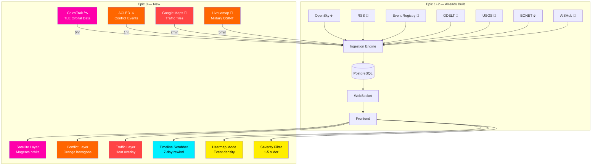
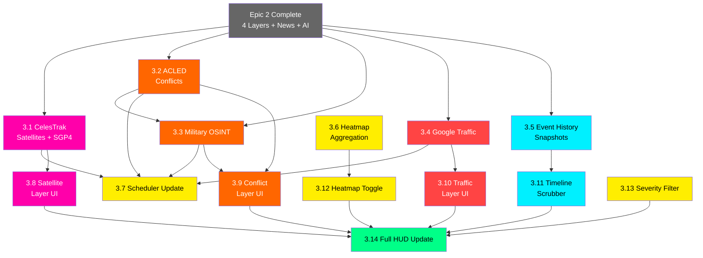

# NEXUS GLOBE — Epic 3: The All-Seeing Eye

### Satellite Orbits + Conflict Zones + Traffic Heatmap + Timeline Scrubber

---

## Epic Summary

**Goal:** Complete the remaining data layers that transform NEXUS GLOBE into a full-spectrum OSINT platform. Satellites orbit the globe in real-time with calculated trajectories, conflict zones glow orange with ACLED data, traffic congestion appears as a heat overlay, and a timeline scrubber lets users rewind history up to 7 days. When this epic is done, all 7 of 8 data layers are live (cameras come in Epic 4), and the dashboard rivals professional intelligence tools.

**Prerequisite:** Epic 2 fully complete (news pipeline, disasters, ships, AI enrichment all working).

**Definition of Done:** User sees satellites tracing magenta orbital paths, orange hexagonal conflict zones in active warzones, green/yellow/red traffic heat overlaying major cities, and can drag a timeline slider to replay how the world looked 3 days ago.

---

## Architecture Context — What This Epic Adds



---

## Stories

This epic contains **14 stories** — 7 backend, 7 frontend.

---

### STORY 3.1 — CelesTrak Satellite TLE Ingestion + SGP4 Propagator
**Track:** Backend
**Points:** 8
**Priority:** P0 — Core Feature

#### Description
Implement satellite tracking by fetching Two-Line Element sets (TLEs) from CelesTrak and using the SGP4 propagation algorithm to calculate real-time positions. Unlike other data sources that give us direct lat/lng, satellites require orbital mechanics — we download orbital parameters and compute where each satellite is at any given moment. The backend calculates positions and pushes them to the frontend at regular intervals.

#### Acceptance Criteria
- [ ] `CelesTrakService` extends `BaseIngestionService`
- [ ] Fetches TLE data from CelesTrak GP API in JSON format:
  ```
  https://celestrak.org/NORAD/elements/gp.php?GROUP=active&FORMAT=json
  https://celestrak.org/NORAD/elements/gp.php?GROUP=stations&FORMAT=json
  https://celestrak.org/NORAD/elements/gp.php?GROUP=starlink&FORMAT=json
  https://celestrak.org/NORAD/elements/gp.php?GROUP=gps-ops&FORMAT=json
  https://celestrak.org/NORAD/elements/gp.php?GROUP=weather&FORMAT=json
  https://celestrak.org/NORAD/elements/gp.php?GROUP=resource&FORMAT=json
  https://celestrak.org/NORAD/elements/gp.php?GROUP=military&FORMAT=json
  ```
- [ ] TLE fetch interval: **6 hours** (TLEs don't change frequently)
- [ ] Position propagation interval: **30 seconds** (recalculate all satellite positions)
- [ ] Uses **sgp4** Python library to propagate TLEs to current time:
  ```python
  from sgp4.api import Satrec, WGS72
  from sgp4.api import jday
  
  satellite = Satrec.twoline2rv(tle_line1, tle_line2, WGS72)
  jd, fr = jday(year, month, day, hour, minute, second)
  e, r, v = satellite.sgp4(jd, fr)
  # r = [x, y, z] in km from Earth center (TEME frame)
  # Convert to lat/lng/altitude using skyfield or manual conversion
  ```
- [ ] Uses **skyfield** for TEME → lat/lng/altitude conversion:
  ```python
  from skyfield.api import EarthSatellite, load
  from skyfield.api import utc
  
  ts = load.timescale()
  sat = EarthSatellite(tle_line1, tle_line2, name, ts)
  t = ts.now()
  geocentric = sat.at(t)
  subpoint = geocentric.subpoint()
  lat, lng, alt = subpoint.latitude.degrees, subpoint.longitude.degrees, subpoint.elevation.km
  ```
- [ ] Normalizes into GlobeEvent objects:
  - `event_type`: "satellite"
  - `category`: classified by satellite group:
    - "stations" → "space_station" (ISS, Tiangong)
    - "starlink" → "communications_constellation"
    - "gps-ops" → "navigation"
    - "weather" → "weather_satellite"
    - "resource" → "earth_observation"
    - "military" → "military_satellite"
  - `title`: satellite name (e.g., "ISS (ZARYA)")
  - `description`: `"{name} — {category} at {altitude}km, period {period}min"`
  - `latitude/longitude`: calculated position from SGP4
  - `altitude`: orbital altitude in km
  - `heading`: direction of travel (computed from velocity vector)
  - `speed`: orbital velocity in km/h
  - `severity`: 1 (routine), 2 (military satellites), 3 (ISS/space stations)
  - `source`: "celestrak"
  - `source_id`: NORAD catalog number
  - `metadata`: `{ norad_id, intl_designator, epoch, inclination_deg, period_min, apogee_km, perigee_km, rcs_size, orbit_type, country_code, launch_date, object_type }`
  - `trail`: predicted orbit path — next 90 minutes of positions (calculated every 5 min = 18 points)
  - `expires_at`: 30 seconds (refreshed on every propagation cycle)
- [ ] **Satellite filtering**: configurable groups to track (default: stations + starlink subset + gps + weather + military)
- [ ] **Starlink limiting**: only track a representative sample (~100 of 6000+) to avoid overwhelming the globe
- [ ] Publishes batch of all satellite positions to `layer:satellite` Redis channel every 30s
- [ ] Handles CelesTrak rate limiting (cache TLEs, don't re-fetch within 6hr window)
- [ ] Logs: `"CelesTrak: propagated 487 satellites in 0.3s (23 stations, 100 starlink, 31 gps, 89 weather, 44 military, 200 other)"`

#### Technical Notes
```python
# Satellite group configuration (configurable via settings)
SATELLITE_GROUPS = {
    "stations": {"url_group": "stations", "max_count": None, "severity": 3},
    "starlink": {"url_group": "starlink", "max_count": 100, "severity": 1},  # Sample only
    "gps": {"url_group": "gps-ops", "max_count": None, "severity": 1},
    "weather": {"url_group": "weather", "max_count": None, "severity": 1},
    "military": {"url_group": "military", "max_count": None, "severity": 2},
    "science": {"url_group": "science", "max_count": 50, "severity": 1},
    "earth_resources": {"url_group": "resource", "max_count": 50, "severity": 1},
}

# Orbit path prediction (trail generation)
async def compute_orbit_trail(satellite, ts, duration_minutes=90, step_minutes=5):
    """Compute future positions for orbit trail visualization."""
    trail = []
    t_start = ts.now()
    for i in range(0, duration_minutes, step_minutes):
        t = ts.tt_jd(t_start.tt + i / (24 * 60))
        geocentric = satellite.at(t)
        subpoint = geocentric.subpoint()
        trail.append([subpoint.longitude.degrees, subpoint.latitude.degrees])
    return trail
```

#### Dependencies
- `sgp4==2.23` (already in requirements.txt)
- `skyfield==1.49` (already in requirements.txt)

#### Files to Create/Modify
- `backend/app/services/ingestion/celestrak.py`
- `backend/app/services/satellite_propagator.py` (new — SGP4 position calculator)
- `backend/app/scheduler.py` (register: TLE fetch every 6hr, propagation every 30s)

---

### STORY 3.2 — ACLED Conflict Data Ingestion Service
**Track:** Backend
**Points:** 5
**Priority:** P0 — Core Feature

#### Description
Implement the Armed Conflict Location & Event Data (ACLED) ingestion service. ACLED is the gold standard for conflict data — it tracks battles, explosions/remote violence, protests, riots, violence against civilians, and strategic developments in every country worldwide, with precise geocoding and detailed actor information.

#### Acceptance Criteria
- [ ] `ACLEDService` extends `BaseIngestionService`
- [ ] Fetches from ACLED API:
  ```
  https://acleddata.com/api/acled/read?key={ACLED_API_KEY}&email={ACLED_EMAIL}&event_date={last_7_days}&event_date_where=>&&limit=500&_format=json
  ```
- [ ] Requires `ACLED_API_KEY` + `ACLED_EMAIL` from environment (skip gracefully if missing)
- [ ] Parses ACLED events into GlobeEvent objects:
  - `event_type`: "conflict"
  - `category`: mapped from ACLED event_type:
    - "Battles" → "battle"
    - "Explosions/Remote violence" → "explosion"
    - "Violence against civilians" → "civilian_violence"
    - "Protests" → "protest"
    - "Riots" → "riot"
    - "Strategic developments" → "strategic"
  - `title`: ACLED notes (first 200 chars) or `"{event_type} in {location}, {country}"`
  - `description`: full ACLED notes text
  - `latitude/longitude`: from ACLED geocoding
  - `severity`: mapped from ACLED event type + fatalities:
    - Battles with fatalities > 10 → 5
    - Explosions/Remote violence → 4
    - Violence against civilians → 4
    - Battles with fatalities ≤ 10 → 3
    - Riots with fatalities → 3
    - Protests (large) → 2
    - Strategic developments → 1
    - Bonus: if fatalities > 50, always severity 5
  - `source`: "acled"
  - `source_id`: ACLED data_id
  - `sourceUrl`: ACLED dashboard link
  - `metadata`: `{ acled_data_id, event_type, sub_event_type, actor1, actor2, assoc_actor1, assoc_actor2, interaction_code, fatalities, country, admin1, admin2, admin3, geo_precision, source_scale, notes, tags, timestamp }`
  - `expires_at`: 30 days (conflict events have long relevance)
- [ ] Fetches last 7 days of data on each poll (with dedup by data_id)
- [ ] Poll interval: **3600 seconds** (1 hour — ACLED updates daily, not real-time)
- [ ] Cross-references with news events: if ACLED battle matches a GDELT/RSS conflict news article within 100km + 24hr, link them
- [ ] Handles missing API key: log warning and skip
- [ ] Logs: `"ACLED: ingested 156 conflict events (47 battles, 23 explosions, 34 protests, 52 other) in 2.8s"`

#### Technical Notes
```python
# ACLED API response format:
# {
#   "status": 200,
#   "success": true,
#   "data": [
#     {
#       "data_id": "12345678",
#       "event_date": "2024-01-15",
#       "event_type": "Battles",
#       "sub_event_type": "Armed clash",
#       "actor1": "Military Forces of Syria",
#       "actor2": "IS (Islamic State)",
#       "interaction": "State Forces vs Rebel Groups",
#       "country": "Syria",
#       "admin1": "Deir-ez-Zor",
#       "location": "Deir-ez-Zor",
#       "latitude": "35.3361",
#       "longitude": "40.1454",
#       "geo_precision": "1",
#       "fatalities": "7",
#       "notes": "On 15 January 2024, Syrian government forces clashed with..."
#     }
#   ]
# }

ACLED_BASE_URL = "https://acleddata.com/api/acled/read"
```

#### Files to Create/Modify
- `backend/app/services/ingestion/acled.py`
- `backend/app/config.py` (ensure acled_api_key + acled_email are optional)
- `backend/app/scheduler.py` (register ACLED with 3600s interval)

---

### STORY 3.3 — Liveuamap Military OSINT Scraper
**Track:** Backend
**Points:** 5
**Priority:** P2 — Enhancement

#### Description
Supplement ACLED with near-real-time military OSINT from open-source aggregators. While ACLED is comprehensive but delayed (updated daily), military OSINT sources like Liveuamap, DeepState, and WikiMedia OSINT aggregate reports within hours. We scrape their public RSS/API feeds for timely conflict intelligence.

#### Acceptance Criteria
- [ ] `MilitaryOSINTService` extends `BaseIngestionService`
- [ ] Aggregates from multiple open sources:
  - Liveuamap RSS: `https://liveuamap.com/rss` (if available)
  - ReliefWeb API: `https://api.reliefweb.int/v1/reports?appname=nexusglobe&filter[field]=primary_country&limit=50`
  - WikiMedia OSINT aggregation (public feeds)
- [ ] Falls back to RSS/web scraping if direct APIs unavailable
- [ ] Parses into GlobeEvent:
  - `event_type`: "conflict"
  - `category`: "military_osint"
  - `severity`: 3-5 (military events are inherently high-severity)
  - `metadata`: `{ osint_source, reported_by, verification_status: "unverified" | "confirmed" }`
- [ ] **Important**: marks all events as `metadata.verification_status: "unverified"` since OSINT sources vary in reliability
- [ ] Cross-references with ACLED events — if ACLED confirms the same event later, update verification_status to "confirmed"
- [ ] Poll interval: **300 seconds** (5 min)
- [ ] Handles source downtime gracefully
- [ ] Logs: `"Military OSINT: ingested 12 reports (8 Liveuamap, 4 ReliefWeb) in 1.2s"`

#### Files to Create/Modify
- `backend/app/services/ingestion/military_osint.py` (new)
- `backend/app/scheduler.py`

---

### STORY 3.4 — Google Maps Traffic Layer Integration
**Track:** Backend
**Points:** 5
**Priority:** P1 — Important

#### Description
Integrate Google Maps traffic data to show real-time congestion as a heatmap overlay on the globe. Unlike other layers that use point markers, traffic is rendered as a colored overlay on roads — green (free flow), yellow (moderate), red (heavy congestion). This requires the Google Maps JavaScript API key.

#### Acceptance Criteria
- [ ] Traffic layer uses **client-side** Google Maps Traffic Tiles (not backend-polled):
  - Google Maps JavaScript API: `maps.googleapis.com/maps/api/js?key={KEY}&libraries=visualization`
  - Traffic tile URL pattern: `https://mt0.google.com/vt?lyrs=h,traffic&x={x}&y={y}&z={z}`
- [ ] Requires `GOOGLE_MAPS_API_KEY` from environment (skip if missing)
- [ ] **Backend responsibility**: proxy/validate API key, provide tile URL template to frontend
  - `GET /api/traffic/config` returns:
    ```json
    {
      "enabled": true,
      "tile_url": "https://mt{s}.google.com/vt?lyrs=h,traffic&x={x}&y={y}&z={z}",
      "api_key_present": true,
      "refresh_interval_s": 120
    }
    ```
- [ ] **Alternative free option** if no Google Maps key: TomTom Traffic Flow API (free tier: 2,500 req/day)
  - Endpoint: `https://api.tomtom.com/traffic/services/4/flowSegmentData/absolute/10/json?key={KEY}&point={lat},{lng}`
  - Requires `TOMTOM_API_KEY` in environment
- [ ] Backend also periodically samples major city traffic status for the HUD:
  - Query top 20 global cities for aggregate congestion level
  - Store as events: `event_type: "traffic"`, one per city
  - `severity`: 1 (free flow) to 5 (gridlock)
  - `metadata`: `{ city_name, avg_speed_kmh, free_flow_speed_kmh, congestion_percent, road_closure_count }`
  - Poll interval: 120 seconds
- [ ] Handles missing API key: show "Traffic layer requires Google Maps API key" in layer controls
- [ ] Logs: `"Traffic: sampled 20 cities, avg congestion 34% in 2.1s"`

#### Technical Notes
```python
# Backend config endpoint
@router.get("/api/traffic/config")
async def get_traffic_config():
    return {
        "enabled": bool(settings.google_maps_api_key),
        "provider": "google" if settings.google_maps_api_key else "tomtom" if settings.tomtom_api_key else None,
        "tile_url_template": f"https://mt{{s}}.google.com/vt?lyrs=h,traffic&x={{x}}&y={{y}}&z={{z}}&key={settings.google_maps_api_key}" if settings.google_maps_api_key else None,
        "refresh_interval_s": 120,
    }

# Major cities for traffic sampling
TRAFFIC_CITIES = [
    {"name": "London", "lat": 51.5074, "lng": -0.1278},
    {"name": "New York", "lat": 40.7128, "lng": -74.0060},
    {"name": "Tokyo", "lat": 35.6762, "lng": 139.6503},
    {"name": "Beijing", "lat": 39.9042, "lng": 116.4074},
    {"name": "Mumbai", "lat": 19.0760, "lng": 72.8777},
    {"name": "São Paulo", "lat": -23.5505, "lng": -46.6333},
    {"name": "Cairo", "lat": 30.0444, "lng": 31.2357},
    {"name": "Lagos", "lat": 6.5244, "lng": 3.3792},
    # ... 12 more
]
```

#### Files to Create/Modify
- `backend/app/services/ingestion/traffic.py`
- `backend/app/api/routes.py` (add /api/traffic/config)
- `backend/app/config.py` (add google_maps_api_key, tomtom_api_key)
- `backend/app/scheduler.py`

---

### STORY 3.5 — Event History & Snapshot Service
**Track:** Backend
**Points:** 5
**Priority:** P0 — Blocker for Timeline

#### Description
The timeline scrubber (Story 3.11) needs the ability to query "what did the world look like at time X?" Currently, events are only served as live streams. This story adds a historical query layer — periodic snapshots of all active events stored in PostgreSQL, queryable by timestamp.

#### Acceptance Criteria
- [ ] **Snapshot system**: every 15 minutes, capture the full set of active events and store as a snapshot
  - Snapshot table:
    ```sql
    CREATE TABLE event_snapshots (
        id UUID PRIMARY KEY DEFAULT gen_random_uuid(),
        snapshot_time TIMESTAMPTZ NOT NULL,
        event_count INTEGER,
        layer_counts JSONB,  -- {"flight": 4832, "news": 47, ...}
        events JSONB          -- Array of compressed event summaries
    );
    CREATE INDEX idx_snapshots_time ON event_snapshots (snapshot_time DESC);
    ```
  - Event summaries in snapshot are compressed (id, type, lat, lng, severity, title only — not full metadata)
- [ ] **Historical query endpoint**:
  ```
  GET /api/events/history?timestamp=2024-01-15T12:00:00Z
  ```
  Returns the nearest snapshot to the requested time + any events that were active at that time
- [ ] **Time range query**:
  ```
  GET /api/events/history/range?start=2024-01-14T00:00:00Z&end=2024-01-15T00:00:00Z&interval=1h
  ```
  Returns array of snapshot summaries (event counts per layer per hour) for timeline rendering
- [ ] Snapshots retained for 7 days, then auto-pruned
- [ ] Snapshot creation runs as a scheduled job (every 15 min)
- [ ] Fast query: snapshot lookup < 200ms even with 7 days of data
- [ ] Logs: `"Snapshot: captured 8,432 events at 2024-01-15T12:00:00Z (4.2MB compressed)"`

#### Files to Create/Modify
- `backend/app/models/snapshot.py` (new — SQLAlchemy model)
- `backend/app/services/snapshot_service.py` (new)
- `backend/app/api/routes.py` (add history endpoints)
- `backend/app/scheduler.py` (add 15-min snapshot job)
- `backend/alembic/` (migration for snapshot table)

---

### STORY 3.6 — Heatmap Data Aggregation Service
**Track:** Backend
**Points:** 3
**Priority:** P1 — Important

#### Description
Support a heatmap visualization mode where instead of individual markers, the globe shows event density as colored heat regions. The backend pre-aggregates events into a hexagonal grid (H3) for efficient heatmap rendering.

#### Acceptance Criteria
- [ ] **Heatmap endpoint**:
  ```
  GET /api/heatmap?resolution=4&types=news,conflict&time=24h
  ```
  Returns H3 hex grid with event counts:
  ```json
  {
    "resolution": 4,
    "hexagons": [
      { "h3_index": "842a100ffffffff", "lat": 51.5, "lng": -0.1, "count": 23, "max_severity": 5, "types": {"news": 15, "conflict": 8} },
      { "h3_index": "842a107ffffffff", "lat": 51.4, "lng": 0.0, "count": 7, "max_severity": 3, "types": {"news": 7} }
    ]
  }
  ```
- [ ] Uses **H3** hexagonal grid system (Uber's geospatial indexing) for uniform hexagons
- [ ] Configurable resolution: 2 (coarse, continent-level) to 6 (fine, city-level)
- [ ] Auto-adjusts resolution based on zoom level (sent by frontend)
- [ ] Filterable by event type and time window
- [ ] Cached in Redis with 60s TTL (recomputed on cache miss)
- [ ] Fast: < 500ms response for full globe heatmap

#### Dependencies
- Add `h3==3.7.7` to requirements.txt

#### Files to Create/Modify
- `backend/app/services/heatmap_service.py` (new)
- `backend/app/api/routes.py` (add /api/heatmap endpoint)
- `backend/requirements.txt` (add h3)

---

### STORY 3.7 — Scheduler & Dedup Updates for New Sources
**Track:** Backend
**Points:** 2
**Priority:** P1 — Important

#### Description
Register all new Epic 3 ingestion services and update dedup rules for conflict cross-referencing.

#### Acceptance Criteria
- [ ] Scheduler registers new services:
  - CelesTrak TLE fetch: 21600s (6hr)
  - CelesTrak position propagation: 30s
  - ACLED: 3600s (1hr)
  - Military OSINT: 300s (5min)
  - Traffic sampling: 120s (2min)
  - Event snapshots: 900s (15min)
- [ ] Dedup rules for conflicts:
  - ACLED battle ↔ Military OSINT report: match within 50km + 24hr
  - ACLED conflict ↔ news "conflict" category: link within 100km + 12hr
- [ ] Startup log shows all registered services (now 10+ services)
- [ ] `/api/services` updated with all new services

#### Files to Create/Modify
- `backend/app/scheduler.py`
- `backend/app/services/dedup.py` (add conflict dedup rules)
- `backend/app/api/routes.py`

---

### STORY 3.8 — Satellite Layer Rendering (Frontend)
**Track:** Frontend
**Points:** 8
**Priority:** P0 — Core Feature (most visually complex layer)

#### Description
Render satellites as magenta dots orbiting the globe with predicted orbital paths drawn as thin lines. This is the most technically challenging frontend layer because satellites move fast (ISS completes an orbit in 90 minutes) and their paths are great circles that wrap around the globe. The visual effect should be stunning — hundreds of magenta dots tracing orbital arcs across the dark globe.

#### Acceptance Criteria
- [ ] Satellites render as small glowing dots on the globe
- [ ] Color: neon magenta `#ff00aa` with glow effect
- [ ] Size varies by category:
  - Space stations (ISS, Tiangong): large dot with bright halo
  - Military: medium dot, slightly brighter glow
  - GPS/Navigation: small dot
  - Weather: small dot
  - Starlink: tiny dot (many of them)
- [ ] **Orbital path**: thin magenta line showing the next 90 minutes of predicted orbit
  - Line fades from solid (current position) to transparent (90 min ahead)
  - Path wraps correctly around the globe (great circle arcs)
- [ ] **Satellite motion**: positions update every 30s, with smooth interpolation between updates
  - Frontend interpolates positions between WebSocket updates for fluid motion
- [ ] Hover tooltip: satellite name, altitude (km), speed (km/h), orbit type, NORAD ID
- [ ] Click detail panel shows:
  - Satellite name and NORAD catalog number
  - Category with icon (🛰️ station, 📡 comms, 🌍 earth obs, ⚔️ military)
  - Current position: lat, lng, altitude
  - Orbital parameters: inclination, period, apogee, perigee
  - Country of origin
  - Launch date
  - Orbit visualization: mini 2D track overlay showing current position on orbit
- [ ] **ISS special treatment**: always visible, larger marker, labeled "ISS" without needing hover
- [ ] Layer toggleable via store
- [ ] **Sub-filters** (optional per satellite group):
  - Show/hide: Starlink, GPS, Weather, Military, Stations
  - Checkbox list in layer controls when satellite layer is expanded
- [ ] Performance: 500 satellites with orbit trails at 60 FPS

#### Visual Reference
```
         ╭──── Orbital path (90 min prediction)
        ╱
    ···●···→ ISS (labeled, large)
   ╱       ╲
  ╱    ·→ GPS-IIF-12 (small)
 ╱       
╱  ·→·→·→ Starlink cluster (tiny dots)
         ╲
    ·→ NROL-82 (military, medium, bright)
     ╲
      ╰──── Orbit trail fades out

Color: all #ff00aa (neon magenta)
```

#### Technical Notes
```typescript
// Globe.GL paths layer for orbital trails
globe
  .pathsData(satelliteOrbits)
  .pathPoints((d: GlobeEvent) => d.trail)  // Array of [lng, lat] points
  .pathColor(() => ['rgba(255,0,170,0.6)', 'rgba(255,0,170,0.05)'])
  .pathStroke(1)
  .pathDashLength(0.5)
  .pathDashGap(0.5)
  .pathDashAnimateTime(50000);  // Slow dash animation along orbit

// Custom Three.js for satellite dots with glow
globe
  .customLayerData(satelliteEvents)
  .customThreeObject((d: GlobeEvent) => {
    const size = d.category === 'space_station' ? 4 : 
                 d.category === 'military_satellite' ? 2 : 1;
    const sprite = new THREE.Sprite(magentaGlowMaterial);
    sprite.scale.set(size, size, 1);
    return sprite;
  });

// Smooth interpolation between 30s position updates
function interpolatePosition(prev: GlobeEvent, next: GlobeEvent, t: number) {
  return {
    latitude: prev.latitude + (next.latitude - prev.latitude) * t,
    longitude: prev.longitude + (next.longitude - prev.longitude) * t,
    altitude: prev.altitude + (next.altitude - prev.altitude) * t,
  };
}
```

#### Files to Create/Modify
- `frontend/src/components/Globe/layers/SatelliteLayer.tsx`
- `frontend/src/components/Globe/GlobeCanvas.tsx` (integrate satellite layer)
- `frontend/src/components/Panel/EventDetail.tsx` (satellite detail view)

---

### STORY 3.9 — Conflict Zone Layer Rendering (Frontend)
**Track:** Frontend
**Points:** 5
**Priority:** P0 — Core Feature

#### Description
Render conflict events as orange hexagonal danger zones on the globe. Unlike point markers, conflict zones should feel like territorial overlays — areas of sustained violence glow orange with intensity proportional to event density and severity. Individual events within a zone are accessible by zooming in.

#### Acceptance Criteria
- [ ] Conflict events render as **hexagonal markers** on the globe
- [ ] Color: neon orange `#ff6600` with pulsing glow
- [ ] Two rendering modes based on zoom level:
  - **Zoomed out**: hexagonal heat zones — clusters of events form glowing orange areas
    - Uses Globe.GL `hexBin` layer
    - Hex opacity and height proportional to event count + severity
    - Creates a "conflict heatmap" effect
  - **Zoomed in**: individual event markers with category icons
    - Battle: ⚔️ crossed swords icon
    - Explosion: 💥 burst icon
    - Protest: ✊ fist icon
    - Civilian violence: 🔴 solid red dot
- [ ] Hexagonal zones pulse slowly (1 cycle per 3 seconds)
- [ ] Active warzones (> 20 events in 7 days within 200km) get a special "ACTIVE CONFLICT" ring:
  - Bright orange outer ring, slowly expanding
  - Label visible when zoomed to region level
- [ ] Hover tooltip: event type + location + actors + fatalities + date
- [ ] Click detail panel shows:
  - Full ACLED notes text
  - Actor 1 vs Actor 2 (with faction/group names)
  - Fatality count with severity badge
  - Date and precise location
  - Verification status badge: "ACLED Verified" or "OSINT — Unverified"
  - Link to ACLED dashboard
  - Related news articles (if cross-linked from news layer)
- [ ] Layer toggleable via store
- [ ] Performance: 500+ conflict events at 60 FPS

#### Visual Reference
```
Zoomed out (hexagonal zones):         Zoomed in (individual markers):

  ⬡⬡⬡                                 ⚔️ Armed clash — Deir ez-Zor
 ⬡⬡⬡⬡  ← Orange hex cluster           💥 Airstrike — Idlib
  ⬡⬡⬡     (Syria)                      ✊ Protest — Damascus
                                        🔴 Civilian attack — Aleppo
    ⬡⬡
   ⬡⬡⬡  ← Fainter hex cluster
    ⬡⬡     (Yemen)

Color: #ff6600 with varying opacity
```

#### Technical Notes
```typescript
// Hex bin layer for zoomed-out conflict zones
globe
  .hexBinPointsData(conflictEvents)
  .hexBinPointLat((d: GlobeEvent) => d.latitude)
  .hexBinPointLng((d: GlobeEvent) => d.longitude)
  .hexBinResolution(4)
  .hexBinMerge(true)
  .hexBinColor((d) => {
    const count = d.points.length;
    const alpha = Math.min(0.9, 0.2 + count * 0.05);
    return `rgba(255,102,0,${alpha})`;
  })
  .hexBinAltitude((d) => Math.min(0.5, d.points.length * 0.02))
  .hexBinLabel((d) => `${d.points.length} conflict events`);
```

#### Files to Create/Modify
- `frontend/src/components/Globe/layers/ConflictLayer.tsx`
- `frontend/src/components/Globe/GlobeCanvas.tsx` (integrate conflict layer)
- `frontend/src/components/Panel/EventDetail.tsx` (conflict detail view)

---

### STORY 3.10 — Traffic Heat Overlay (Frontend)
**Track:** Frontend
**Points:** 5
**Priority:** P1 — Important

#### Description
Render traffic data as a colored overlay when zoomed into city level. At globe level, show traffic "severity dots" for major cities (green = flowing, red = congested). At city zoom, show actual Google Maps traffic tiles overlaid on the globe.

#### Acceptance Criteria
- [ ] **Globe level** (zoomed out): colored dots on major cities
  - Green `#00ff88`: low congestion (< 20%)
  - Yellow `#ffee00`: moderate congestion (20-50%)
  - Orange `#ff6600`: heavy congestion (50-75%)
  - Red `#ff2244`: severe congestion (> 75%)
  - Dot size proportional to city importance
  - Dot pulses faster as congestion increases
- [ ] **City level** (zoomed in): Google Maps traffic tile overlay
  - Fetches tile URL from `/api/traffic/config`
  - Overlays traffic tiles as a semi-transparent custom layer
  - Auto-refreshes every 120 seconds
  - Falls back to dot-only mode if no API key
- [ ] Hover tooltip (globe level): city name + congestion % + avg speed
- [ ] Click (globe level): fly to city and activate tile overlay
- [ ] "Traffic requires Google Maps API key" message if key not configured
- [ ] Layer toggleable via store
- [ ] Performance: tile overlay doesn't impact globe FPS below 30

#### Technical Notes
```typescript
// City-level traffic dots from WebSocket data
const trafficDots = trafficEvents.map(event => ({
  lat: event.latitude,
  lng: event.longitude,
  color: congestionToColor(event.metadata.congestion_percent),
  radius: 0.3,
  label: `${event.metadata.city_name}: ${event.metadata.congestion_percent}%`
}));

function congestionToColor(pct: number): string {
  if (pct < 20) return '#00ff88';
  if (pct < 50) return '#ffee00';
  if (pct < 75) return '#ff6600';
  return '#ff2244';
}

// Google Maps traffic tile overlay (when zoomed to city level)
// Use Globe.GL tilesLayerData or custom Three.js texture mapping
```

#### Files to Create/Modify
- `frontend/src/components/Globe/layers/TrafficLayer.tsx`
- `frontend/src/components/Globe/GlobeCanvas.tsx`

---

### STORY 3.11 — Timeline Scrubber Component
**Track:** Frontend
**Points:** 8
**Priority:** P0 — Core Feature

#### Description
Build the timeline scrubber — a horizontal time slider at the bottom of the screen that lets users travel back in time up to 7 days. Dragging the slider loads historical snapshots and re-renders the globe to show what was happening at that moment. A play button auto-advances through time, creating a timelapse of global events.

#### Acceptance Criteria
- [ ] Horizontal slider bar at the bottom of the screen
- [ ] Range: 7 days ago → now (now is the right edge, default position)
- [ ] Drag handle to scrub to any point in the past 7 days
- [ ] When dragged: fetches historical snapshot from `/api/events/history?timestamp={t}`
  - Globe updates to show only events that were active at time `t`
  - Real-time WebSocket stream pauses while in historical mode
  - "HISTORICAL MODE — {date/time}" banner appears in HUD
- [ ] **Play button** (▶): auto-advances time at configurable speed
  - Speed options: 1x (real-time), 10x, 60x, 360x (1hr per second)
  - Shows "▶ PLAYING 60x" in HUD
  - Pause button (⏸) stops playback
- [ ] **Time indicators on slider**:
  - Major ticks: every 24 hours with date labels
  - Minor ticks: every 6 hours
  - Event density sparkline above the slider (tiny bar chart showing event counts over time)
- [ ] **Live button** (●): returns to real-time mode
  - Resumes WebSocket stream
  - Removes "HISTORICAL MODE" banner
  - Slider handle snaps to right edge
- [ ] When switching layers on/off during historical mode: re-filters historical data
- [ ] Cyberpunk styling:
  - Slider track: thin neon cyan line
  - Handle: glowing cyan dot
  - Time labels: `--font-mono`
  - Event density sparkline: filled area chart in cyan with low opacity
  - "LIVE" button glows red when active
- [ ] Performance: switching between timestamps < 500ms
- [ ] Keyboard shortcuts:
  - `Space`: toggle play/pause
  - `←` `→`: step back/forward 1 hour
  - `L`: return to live

#### Visual Reference
```
┌───────────────────────────────────────────────────────────────────────┐
│  ▄ ▂▄▆▄▂  ▂▄▆█▆▄▂   ▂▄▆▄▂  ▂▄▆▄   ← Event density sparkline     │
│  ──────────────────────●────────────────────────────────────── ● LIVE │
│  Jan 8     Jan 9     Jan 10    Jan 11    Jan 12    Jan 13    Jan 14  │
│  ◄◄  ◄  ▶ 60x  ►  ►►                    ↑ Current position          │
└───────────────────────────────────────────────────────────────────────┘
```

#### Files to Create/Modify
- `frontend/src/components/Timeline/TimelineScrubber.tsx`
- `frontend/src/components/Timeline/PlaybackControls.tsx`
- `frontend/src/components/Timeline/DensitySparkline.tsx` (new)
- `frontend/src/hooks/useTimeTravel.ts` (new — manages historical vs live mode)
- `frontend/src/stores/globeStore.ts` (add timeMode: 'live' | 'historical', currentViewTime)
- `frontend/src/App.tsx` (integrate timeline)

---

### STORY 3.12 — Heatmap Toggle Mode (Frontend)
**Track:** Frontend
**Points:** 3
**Priority:** P2 — Enhancement

#### Description
Add a "Heatmap Mode" toggle that replaces individual markers with a hexagonal density heatmap across the entire globe. This gives a bird's-eye view of where in the world the most activity is happening.

#### Acceptance Criteria
- [ ] Toggle button in layer controls: "HEATMAP MODE" on/off
- [ ] When active:
  - All individual markers hidden
  - Globe shows hexagonal heat overlay from `/api/heatmap`
  - Color gradient: dark blue (few events) → cyan → green → yellow → red (many events)
  - Hex altitude proportional to event density (3D bar effect)
  - Click a hex: shows event count + types breakdown + top severity
- [ ] Resolution adapts to zoom level:
  - Globe view: resolution 2-3 (large hexes, continent-scale)
  - Region view: resolution 4-5 (medium hexes, country-scale)
  - City view: resolution 6 (small hexes, city-scale)
- [ ] Filterable by event type (show heatmap of only conflict, only news, etc.)
- [ ] Works in both live and historical timeline modes
- [ ] Keyboard shortcut: `H` toggles heatmap mode

#### Technical Notes
```typescript
// Globe.GL hexed polygon layer
globe
  .hexedPolygonsData(heatmapData.hexagons)
  .hexedPolygonLat((d) => d.lat)
  .hexedPolygonLng((d) => d.lng)
  .hexedPolygonResolution(zoomToResolution(currentZoom))
  .hexedPolygonAltitude((d) => d.count * 0.005)
  .hexedPolygonColor((d) => densityToColor(d.count, d.max_severity));
```

#### Files to Create/Modify
- `frontend/src/components/Controls/HeatmapToggle.tsx` (new)
- `frontend/src/components/Globe/GlobeCanvas.tsx` (heatmap render mode)
- `frontend/src/stores/globeStore.ts` (add heatmapMode boolean)

---

### STORY 3.13 — Severity Filter Slider (Frontend)
**Track:** Frontend
**Points:** 2
**Priority:** P1 — Important

#### Description
Add a severity range slider that filters all visible events by severity level (1-5). Users can set a minimum severity to focus on high-priority events only.

#### Acceptance Criteria
- [ ] Dual-handle range slider in control panel: [1] ———●———●——— [5]
- [ ] Filtering is client-side (events already in Zustand store, just filter before render)
- [ ] Changes are instant — markers appear/disappear as slider moves
- [ ] Shows count of visible events: "Showing 234 of 8,432 events"
- [ ] Severity labels with colors:
  - 1: Informational (gray)
  - 2: Low (green)
  - 3: Moderate (yellow)
  - 4: High (orange)
  - 5: Critical (red)
- [ ] Default range: [1, 5] (show everything)
- [ ] Quick preset buttons: "All" | "Important (3+)" | "Critical (5)"
- [ ] Cyberpunk styling: neon slider track, glowing handles

#### Files to Create/Modify
- `frontend/src/components/Controls/SeveritySlider.tsx`
- `frontend/src/components/Controls/LayerControls.tsx` (add slider)
- `frontend/src/stores/globeStore.ts` (severityRange already exists, connect to filter)

---

### STORY 3.14 — Full Layer Controls & HUD Final Update
**Track:** Frontend
**Points:** 3
**Priority:** P1 — Important

#### Description
Update HUD and layer controls to show all 7 active layers, with sub-filters for satellites and severity.

#### Acceptance Criteria
- [ ] All 7 layers active with toggles and counts:
  - ✈️ Flights — yellow — `4,832`
  - 📰 News — cyan — `47 (12 RSS • 23 ER • 12 GDELT)`
  - 🌋 Disasters — red — `12`
  - 🚢 Ships — green — `2,847`
  - 🛰️ Satellites — magenta — `487` (expandable: stations/starlink/gps/weather/military)
  - ⚔️ Conflicts — orange — `156` (expandable: battles/explosions/protests)
  - 🚗 Traffic — multi — `20 cities`
- [ ] 📹 Cameras — "Coming in Epic 4" (dimmed)
- [ ] Satellite sub-filters: checkboxes for each satellite group
- [ ] Conflict sub-filters: checkboxes for each conflict type
- [ ] Severity slider integrated (Story 3.13)
- [ ] Heatmap toggle button (Story 3.12)
- [ ] HUD shows:
  - "INTEL FEEDS: 7/8 ACTIVE"
  - "TOTAL EVENTS: 8,381"
  - "AI: K2.5 via OpenRouter ●"
  - "MODE: LIVE" or "MODE: HISTORICAL — Jan 12 14:00 UTC"
  - Per-layer counts with colors
- [ ] Keyboard shortcuts expanded: `1`-`7` for layers, `H` heatmap, `Space` play, `L` live
- [ ] All animations smooth, consistent cyberpunk aesthetic

#### Files to Create/Modify
- `frontend/src/components/Controls/LayerControls.tsx`
- `frontend/src/components/Controls/LayerToggle.tsx`
- `frontend/src/components/HUD/LiveStats.tsx`
- `frontend/src/components/HUD/HUDOverlay.tsx`

---

## Story Dependency Graph



---

## Suggested Work Order

| Day | Backend Developer | Frontend Developer |
|-----|-------------------|--------------------|
| 1 | 3.1 CelesTrak + SGP4 Propagator | 3.8 Satellite Layer UI (mock orbits) |
| 2 | 3.1 continued (orbit trail prediction) | 3.8 continued (orbit paths + glow) |
| 3 | 3.2 ACLED Conflict Ingestion | 3.9 Conflict Zone Layer UI |
| 4 | 3.3 Military OSINT | 3.10 Traffic Layer UI |
| 5 | 3.4 Google Traffic Integration | 3.11 Timeline Scrubber |
| 6 | 3.5 Event History + Snapshots | 3.11 continued (playback + sparkline) |
| 7 | 3.6 Heatmap Aggregation | 3.12 Heatmap Toggle + 3.13 Severity Filter |
| 8 | 3.7 Scheduler + Integration | 3.14 Full HUD + Layer Controls |
| 9 | End-to-end testing | End-to-end testing |
| 10 | Performance optimization | Polish & bug fixes |

Solo order: 3.1 → 3.8 → 3.2 → 3.3 → 3.9 → 3.4 → 3.10 → 3.5 → 3.11 → 3.6 → 3.12 → 3.13 → 3.7 → 3.14

---

## Updated .env.example Additions

```env
# === CONFLICT DATA ===
ACLED_API_KEY=                           # Free: register at acleddata.com
ACLED_EMAIL=                             # Email used for ACLED registration

# === TRAFFIC ===
GOOGLE_MAPS_API_KEY=AIza...              # Required for traffic tiles
TOMTOM_API_KEY=                          # Alternative free traffic source

# === (Existing keys from Epic 1+2 remain) ===
```

---

## Updated requirements.txt Additions

```
h3==3.7.7
```
(sgp4 and skyfield already in requirements from scaffolding)

---

## Testing Checklist

### Backend Tests
- [ ] CelesTrak TLE fetch returns valid orbital elements (JSON format)
- [ ] SGP4 propagates ISS position within 10km of known position
- [ ] Satellite positions update every 30s via WebSocket
- [ ] Orbit trail prediction generates valid 90-min path
- [ ] Starlink limiting: only ~100 Starlinks tracked (not 6000+)
- [ ] ACLED fetch returns valid conflict events with geocoding
- [ ] ACLED handles missing API key gracefully
- [ ] Military OSINT marks events as "unverified"
- [ ] Cross-reference: ACLED confirms OSINT report → status updated
- [ ] Traffic config endpoint returns correct provider info
- [ ] Traffic city sampling returns congestion data for 20 cities
- [ ] Event snapshots captured every 15 minutes
- [ ] Historical query returns correct snapshot for given timestamp
- [ ] Heatmap endpoint returns H3 hexagons with event counts
- [ ] All 10+ services run concurrently without interference

### Frontend Tests
- [ ] Satellites render as magenta dots with orbital paths
- [ ] ISS is always visible with label
- [ ] Satellite positions interpolate smoothly between updates
- [ ] Conflict hexagons appear in active warzones
- [ ] Zooming into conflict zone shows individual event markers
- [ ] Traffic dots colored by congestion (green → red)
- [ ] Traffic tiles overlay when zoomed to city level
- [ ] Timeline slider scrubs through 7 days of history
- [ ] Play button advances time at configurable speed
- [ ] "LIVE" button returns to real-time
- [ ] "HISTORICAL MODE" banner appears during time travel
- [ ] Heatmap mode shows density hexagons
- [ ] Severity slider filters events in real-time
- [ ] All 7 layers toggle independently with keyboard shortcuts
- [ ] Performance: 9000+ markers + 500 satellite paths at 30+ FPS

### End-to-End Smoke Test
```
1.  docker-compose up
2.  Open localhost:5173
3.  Previous 4 layers still working (flights, news, disasters, ships)     ✓
4.  Magenta dots visible orbiting the globe (satellites)                   ✓
5.  ISS labeled and clearly visible                                        ✓
6.  Orbital paths drawn as fading magenta lines                           ✓
7.  Orange hexagonal zones in Syria, Ukraine, Sudan (conflict)             ✓
8.  Click conflict → shows actors, fatalities, ACLED data                  ✓
9.  Traffic dots on major cities (colored by congestion)                    ✓
10. Drag timeline slider → globe shows historical state                    ✓
11. Press Play → timelapse of last 7 days                                  ✓
12. Press L → returns to live                                              ✓
13. Press H → heatmap mode shows density                                   ✓
14. Severity slider → filtering works instantly                            ✓
15. Keys 1-7 toggle all layers                                             ✓
16. HUD: "INTEL FEEDS: 7/8 ACTIVE | TOTAL: 9,247"                        ✓
17. All 7 layers visible at 30+ FPS                                        ✓
```

---

## API Keys Required for This Epic

| Service | Key | How to Get | Required? |
|---------|-----|-----------|-----------|
| **ACLED** | `ACLED_API_KEY` + `ACLED_EMAIL` | [acleddata.com](https://acleddata.com) — free academic/media access | Recommended (conflict layer disabled without) |
| **Google Maps** | `GOOGLE_MAPS_API_KEY` | [console.cloud.google.com](https://console.cloud.google.com) | Optional (traffic tiles need it, dots work without) |
| **TomTom** | `TOMTOM_API_KEY` | [developer.tomtom.com](https://developer.tomtom.com) — free 2500 req/day | Alternative to Google Maps |
| CelesTrak | None | Free, no auth | — |
| Liveuamap / ReliefWeb | None | Free / public feeds | — |

---

## Definition of Done — Epic Complete When:

1. **Satellite layer**: magenta dots orbit the globe with 90-minute orbital path predictions
2. ISS always visible and labeled, SGP4 positions accurate within 10km
3. Satellite sub-filters: toggle Starlink/GPS/Weather/Military independently
4. **Conflict layer**: orange hexagonal zones in active warzones with ACLED data
5. Conflict detail shows actors, fatalities, verification status
6. Military OSINT supplements ACLED with near-real-time reports
7. **Traffic layer**: colored congestion dots on 20+ major cities
8. Traffic tile overlay when zoomed to city level (if Google Maps key present)
9. **Timeline scrubber**: drag to replay last 7 days, play/pause at variable speed
10. Historical mode banner + automatic pause of live WebSocket
11. **Heatmap mode**: hexagonal density overlay replaces markers
12. **Severity filter**: range slider 1-5 with instant client-side filtering
13. All 7 of 8 layers active (cameras deferred to Epic 4)
14. Layer controls show sub-filters for satellites and conflicts
15. HUD shows 7/8 feeds active + total event count + mode (live/historical)
16. Keyboard shortcuts 1-7 + H + Space + L all working
17. Performance: 9000+ markers at 30+ FPS
18. No console errors, graceful handling of missing API keys

---

*Epic 3 of 5 — NEXUS GLOBE*
*Estimated effort: 67 story points | 10 working days (solo) | 6 days (pair)*
*Dependencies: Epic 2 complete*