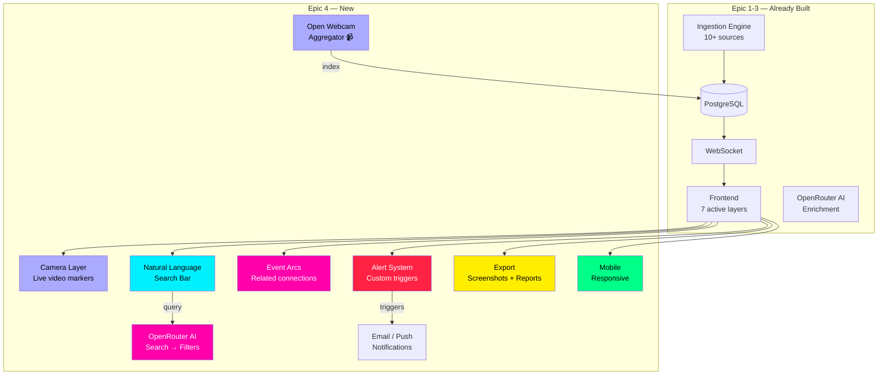
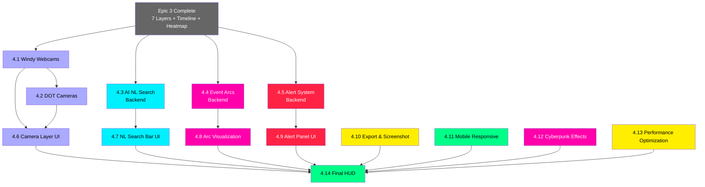

# NEXUS GLOBE — Epic 4: Eyes Everywhere

### Live Cameras + AI Natural Language Search + Event Arcs + Alert System + Polish

---

## Epic Summary

**Goal:** Complete the 8th and final data layer (live cameras), add the AI-powered intelligence features that make NEXUS GLOBE feel like a real command center, and polish the experience to near-production quality. When this epic is done, users can click camera markers to see live video feeds from around the world, type natural language queries like "show me naval activity near Taiwan this week" and watch the globe respond, see animated arcs connecting related events, set up alerts for specific regions or threat levels, and export screenshots of the current globe state.

**Prerequisite:** Epic 3 fully complete (all 7 layers active, timeline scrubber, heatmap, severity filter).

**Definition of Done:** All 8 data layers live. User can search in natural language, see event relationship arcs, receive alerts, watch live camera feeds, and export the current view. The dashboard feels like a finished product.

---

## Architecture Context — What This Epic Adds



---

## Camera Layer — Source Strategy

Live cameras are fragmented across many sources. Our approach: aggregate as many open/public feeds as possible into a unified index.

| Source | Type | Coverage | Access |
|--------|------|----------|--------|
| **DOT Traffic Cams** | Highway/road cameras | USA, Europe, Australia | Free — state DOT APIs and feeds |
| **Insecam.org** | Unsecured IP cameras | Global (ethically curated subset) | Free — public directory |
| **EarthCam** | Tourist/city webcams | Major cities worldwide | Free embeds available |
| **Windy.com Webcams** | Weather + city cams | Global, 40,000+ cameras | Free API: `api.windy.com/webcams/v2` |
| **Airport Webcams** | Airport operations | Major airports | Free — airline/airport sites |
| **YouTube Live** | Live streams | Various | YouTube Data API (free tier) |

**Primary recommended source: Windy.com Webcam API** — it has 40,000+ cameras worldwide with lat/lng coordinates, thumbnail previews, and embed URLs, all accessible via a free API with registration.

---

## Stories

This epic contains **14 stories** — 5 backend, 9 frontend.

---

### STORY 4.1 — Windy Webcam Ingestion Service
**Track:** Backend
**Points:** 5
**Priority:** P0 — Core Feature (final layer)

#### Description
Implement the camera layer data source using the Windy.com Webcam API as the primary provider. Windy maintains the world's largest database of webcams — over 40,000 cameras with GPS coordinates, preview images, live player URLs, and category tags. This gives us instant global camera coverage.

#### Acceptance Criteria
- [ ] `WindyWebcamService` extends `BaseIngestionService`
- [ ] Fetches from Windy Webcam API v2:
  ```
  https://api.windy.com/webcams/v2/list/limit=200/orderby=popularity?show=webcams:location,image,player,url,categories&key={WINDY_API_KEY}
  ```
- [ ] Also supports geographic bounding box queries:
  ```
  https://api.windy.com/webcams/v2/list/nearby={lat},{lng},{radius_km}/limit=50?show=webcams:location,image,player&key={WINDY_API_KEY}
  ```
- [ ] Requires `WINDY_API_KEY` from environment (skip if missing)
- [ ] Parses webcam entries into GlobeEvent objects:
  - `event_type`: "camera"
  - `category`: from Windy categories:
    - "traffic" → "traffic_cam"
    - "city" → "city_cam"
    - "beach" → "beach_cam"
    - "landscape" → "landscape_cam"
    - "airport" → "airport_cam"
    - "harbor" → "harbor_cam"
    - "weather" → "weather_cam"
    - Other → "webcam"
  - `title`: webcam title (e.g., "Times Square - New York City")
  - `description`: location context + camera category
  - `latitude/longitude`: from Windy location data
  - `severity`: 1 (cameras are informational, not alerts)
  - `source`: "windy_webcam"
  - `source_id`: Windy webcam ID
  - `sourceUrl`: Windy webcam page URL
  - `metadata`:
    ```json
    {
      "webcam_id": "1234567890",
      "thumbnail_url": "https://images-webcams.windy.com/...",
      "player_embed_url": "https://webcams.windy.com/webcams/public/embed/player/.../day",
      "player_live_url": "https://webcams.windy.com/webcams/public/embed/player/.../live",
      "categories": ["city", "traffic"],
      "country": "US",
      "city": "New York",
      "continent": "North America",
      "status": "active",
      "last_update": "2024-01-15T12:00:00Z"
    }
    ```
  - `expires_at`: null (cameras are persistent, re-indexed periodically)
- [ ] **Initial full index**: fetch all cameras on first run (paginated, ~40,000 total)
- [ ] **Incremental updates**: re-check camera status every 6 hours
- [ ] Filters out inactive/offline cameras
- [ ] Poll interval: **21600 seconds** (6 hours — camera locations don't change)
- [ ] Handles missing API key gracefully
- [ ] Logs: `"Windy Webcams: indexed 38,247 cameras (12,340 traffic, 8,921 city, 17,086 other) in 12.4s"`

#### Technical Notes
```python
# Windy API response format:
# {
#   "result": {
#     "webcams": [
#       {
#         "id": "1234567890",
#         "title": "Times Square - New York City",
#         "status": "active",
#         "location": {
#           "city": "New York",
#           "region": "New York",
#           "country": "United States",
#           "continent": "North America",
#           "latitude": 40.758,
#           "longitude": -73.9855
#         },
#         "image": {
#           "current": { "preview": "https://...", "thumbnail": "https://..." }
#         },
#         "player": {
#           "live": { "embed": "https://..." },
#           "day": { "embed": "https://..." }
#         },
#         "categories": [{ "id": "city", "name": "City" }],
#         "url": { "current": { "desktop": "https://..." } }
#       }
#     ]
#   }
# }

WINDY_BASE = "https://api.windy.com/webcams/v2/list"
```

#### Files to Create/Modify
- `backend/app/services/ingestion/webcams.py` (new)
- `backend/app/config.py` (add windy_api_key)
- `backend/app/scheduler.py` (register with 6hr interval)

---

### STORY 4.2 — DOT Traffic Camera Aggregator
**Track:** Backend
**Points:** 3
**Priority:** P2 — Enhancement

#### Description
Supplement Windy webcams with US DOT (Department of Transportation) traffic cameras for highway coverage. Many state DOTs provide free camera feeds with direct image/stream URLs.

#### Acceptance Criteria
- [ ] `DOTCameraService` extends `BaseIngestionService`
- [ ] Aggregates from multiple state DOT feeds:
  ```
  Caltrans (California):  https://cwwp2.dot.ca.gov/data/d3/cctv/cctvStatusD03.json
  NYSDOT (New York):      https://511ny.org/api/getcameras?key={key}&format=json
  TxDOT (Texas):          https://its.txdot.gov/ITS_WEB/FrontEnd/default.html (scrape API)
  FDOT (Florida):         https://fl511.com/api/cameras
  ```
- [ ] No API keys required for most DOT feeds (public data)
- [ ] Parses into GlobeEvent with `category: "dot_traffic_cam"`
- [ ] `metadata` includes: `{ dot_source, highway, direction, image_url, stream_url, last_image_time }`
- [ ] Deduplicates with Windy cameras by location proximity (< 100m)
- [ ] Poll interval: **21600 seconds** (6 hours)
- [ ] Logs: `"DOT Cameras: indexed 2,847 highway cameras (CA: 1,204, NY: 892, TX: 751)"`

#### Files to Create/Modify
- `backend/app/services/ingestion/dot_cameras.py` (new)
- `backend/app/scheduler.py`

---

### STORY 4.3 — AI Natural Language Search Service
**Track:** Backend
**Points:** 8
**Priority:** P0 — Key Intelligence Feature

#### Description
Implement natural language search — the user types a query in plain English, the AI translates it into structured filters, and the globe responds by highlighting matching events and flying the camera to the relevant area. This uses OpenRouter (same configurable model as Epic 2) to parse search intent.

#### Acceptance Criteria
- [ ] `POST /api/search/natural` endpoint accepts natural language query:
  ```json
  { "query": "show me naval activity near Taiwan this week" }
  ```
- [ ] OpenRouter AI parses query into structured filters:
  ```json
  {
    "intent": "filter_and_focus",
    "filters": {
      "event_types": ["ship", "conflict", "news"],
      "categories": ["military", "naval"],
      "keywords": ["naval", "Taiwan"],
      "geographic": {
        "center_lat": 23.5,
        "center_lng": 121.0,
        "radius_km": 500,
        "region_name": "Taiwan Strait"
      },
      "time_range": {
        "start": "2024-01-08T00:00:00Z",
        "end": "2024-01-15T00:00:00Z"
      },
      "severity_min": null
    },
    "camera_action": {
      "fly_to_lat": 23.5,
      "fly_to_lng": 121.0,
      "zoom_altitude": 1.5
    },
    "explanation": "Showing ships, military conflicts, and news about naval activity within 500km of Taiwan from the past 7 days."
  }
  ```
- [ ] Backend executes the structured query against PostgreSQL:
  - Geospatial filter (PostGIS bounding circle)
  - Time range filter
  - Event type and category filter
  - Full-text search on title/description for keywords
- [ ] Returns matching events + AI explanation + camera fly-to coordinates
- [ ] **Example queries the system should handle**:
  ```
  "what's happening in Ukraine right now"
  "show me earthquakes above magnitude 5 this month"
  "are there any protests in South America"
  "military activity in the South China Sea"
  "where are the most flights right now"
  "find all ships near the Suez Canal"
  "breaking news in the Middle East"
  "show me everything severity 4 and above"
  "satellite passes over North Korea"
  "compare conflict activity in Syria vs Yemen"
  ```
- [ ] AI prompt for search parsing:
  ```
  You are a geospatial search engine for an OSINT intelligence dashboard.
  Parse this natural language query into structured filters.
  
  Available event types: news, flight, ship, satellite, disaster, conflict, traffic, camera
  Available categories: [full list]
  Current date: {now}
  
  User query: "{query}"
  
  Return JSON with: intent, filters (event_types, categories, keywords, geographic, time_range, severity_min), camera_action (fly_to_lat, fly_to_lng, zoom_altitude), explanation
  ```
- [ ] Uses same OpenRouter config as Epic 2 (AI_MODEL env var)
- [ ] Rate limited: max 10 search queries per minute per client
- [ ] Response time: < 3 seconds (AI call + DB query)
- [ ] Fallback: if AI is unavailable, fall back to simple keyword search on title/description
- [ ] Logs: `"NL Search [google/gemini-2.5-flash-preview]: 'naval activity near Taiwan' → 23 results in 1.8s"`

#### Technical Notes
```python
@router.post("/api/search/natural")
async def natural_language_search(request: NLSearchRequest, db: AsyncSession = Depends(get_db)):
    # Step 1: AI parses natural language into structured filters
    ai_result = await ai_analyzer.parse_search_query(request.query)
    
    # Step 2: Build PostGIS query from structured filters
    stmt = select(Event)
    
    if ai_result.filters.geographic:
        geo = ai_result.filters.geographic
        point = f"POINT({geo.center_lng} {geo.center_lat})"
        stmt = stmt.where(
            ST_DWithin(Event.location, ST_GeogFromText(point), geo.radius_km * 1000)
        )
    
    if ai_result.filters.event_types:
        stmt = stmt.where(Event.event_type.in_(ai_result.filters.event_types))
    
    if ai_result.filters.time_range:
        stmt = stmt.where(Event.created_at >= ai_result.filters.time_range.start)
        stmt = stmt.where(Event.created_at <= ai_result.filters.time_range.end)
    
    if ai_result.filters.keywords:
        keyword_filter = or_(*[
            Event.title.ilike(f"%{kw}%") for kw in ai_result.filters.keywords
        ])
        stmt = stmt.where(keyword_filter)
    
    results = await db.execute(stmt.limit(200))
    events = results.scalars().all()
    
    return {
        "query": request.query,
        "explanation": ai_result.explanation,
        "result_count": len(events),
        "camera_action": ai_result.camera_action,
        "events": [serialize_event(e) for e in events],
    }
```

#### Files to Create/Modify
- `backend/app/services/search_service.py` (new)
- `backend/app/api/routes.py` (add /api/search/natural)
- `backend/app/services/ai_analyzer.py` (add parse_search_query method)

---

### STORY 4.4 — Event Relationship & Arc Service
**Track:** Backend
**Points:** 5
**Priority:** P1 — Intelligence Feature

#### Description
Build a service that identifies relationships between events and generates arc data for visualization. When a conflict in Syria triggers news coverage globally, refugee movements, and UN resolutions, these connections should be visible as animated arcs on the globe connecting the related events.

#### Acceptance Criteria
- [ ] `EventRelationshipService` identifies connections between events:
  - **Same-story arcs**: news from multiple countries about the same event
    - Detected by: cross-source dedup `metadata.confirmed_by` having multiple source locations
  - **Cause-effect arcs**: disaster → news coverage → aid response
    - Detected by: AI analysis finding related_context linking events
  - **Geographic flow arcs**: conflict zone → refugee destination countries
    - Detected by: ACLED events + news about same actors in different locations
  - **Military movement arcs**: troop movements between locations
    - Detected by: sequential conflict events with same actors, different locations
- [ ] `GET /api/arcs?types=news,conflict&time=24h` returns arc data:
  ```json
  {
    "arcs": [
      {
        "id": "arc_001",
        "type": "same_story",
        "from": { "lat": 33.5, "lng": 36.3, "event_id": "evt_001", "label": "Damascus" },
        "to": { "lat": 51.5, "lng": -0.1, "event_id": "evt_002", "label": "London (BBC report)" },
        "strength": 0.8,
        "color": "#00f0ff",
        "label": "Syria conflict coverage"
      },
      {
        "id": "arc_002",
        "type": "cause_effect",
        "from": { "lat": -2.5, "lng": 29.9, "event_id": "evt_010", "label": "M6.1 Earthquake" },
        "to": { "lat": 46.2, "lng": 6.1, "event_id": "evt_015", "label": "UN relief coordination" },
        "strength": 0.6,
        "color": "#ff2244"
      }
    ]
  }
  ```
- [ ] Arc detection runs as a background job every 5 minutes
- [ ] Uses AI (OpenRouter) for complex relationship detection:
  - Batch analysis: "Given these 50 events, identify which are related and why"
  - Only run on high-severity events (4-5) to manage cost
- [ ] Simple relationships (same-story) detected without AI (pure dedup logic)
- [ ] Cached in Redis with 5-minute TTL
- [ ] Logs: `"Arcs: identified 23 relationships (12 same-story, 8 cause-effect, 3 movement)"`

#### Files to Create/Modify
- `backend/app/services/arc_service.py` (new)
- `backend/app/api/routes.py` (add /api/arcs)
- `backend/app/scheduler.py` (register arc detection every 5min)

---

### STORY 4.5 — Alert System Service
**Track:** Backend
**Points:** 5
**Priority:** P1 — Intelligence Feature

#### Description
Build an alert system that lets users define custom triggers and get notified when matching events appear. A user might set "alert me when any severity 5 event happens within 500km of Tel Aviv" or "notify me of any military activity in the South China Sea."

#### Acceptance Criteria
- [ ] Alert rules stored in PostgreSQL:
  ```sql
  CREATE TABLE alert_rules (
      id UUID PRIMARY KEY,
      name VARCHAR(200),
      user_id VARCHAR(100),  -- Session-based for now, user accounts in Epic 5
      filters JSONB,         -- Same structure as search filters
      notify_via VARCHAR(20), -- 'websocket' | 'browser_push' | 'email'
      cooldown_minutes INT DEFAULT 30,  -- Don't re-alert for same trigger
      enabled BOOLEAN DEFAULT true,
      last_triggered_at TIMESTAMPTZ,
      created_at TIMESTAMPTZ DEFAULT NOW()
  );
  ```
- [ ] REST endpoints:
  ```
  POST /api/alerts          — create alert rule
  GET  /api/alerts          — list user's alert rules
  PUT  /api/alerts/{id}     — update rule
  DELETE /api/alerts/{id}   — delete rule
  GET  /api/alerts/history  — past triggered alerts
  ```
- [ ] Alert rule filter structure (same as search filters):
  ```json
  {
    "name": "Taiwan Strait Military Alert",
    "filters": {
      "event_types": ["conflict", "ship", "news"],
      "categories": ["military", "naval"],
      "geographic": { "center_lat": 23.5, "center_lng": 121.0, "radius_km": 500 },
      "severity_min": 3,
      "keywords": ["military", "naval", "warship"]
    },
    "notify_via": "websocket",
    "cooldown_minutes": 60
  }
  ```
- [ ] **Alert evaluation engine**: runs every 60 seconds
  - Checks all enabled alert rules against new events from the last 60 seconds
  - If event matches a rule AND cooldown has passed: trigger alert
  - Alert payload pushed via WebSocket:
    ```json
    {
      "type": "alert_triggered",
      "data": {
        "alert_id": "...",
        "alert_name": "Taiwan Strait Military Alert",
        "event": { ...matching GlobeEvent },
        "triggered_at": "2024-01-15T12:34:56Z"
      }
    }
    ```
- [ ] **Browser push notifications** (optional): if user grants permission
- [ ] **Email notifications** (future): placeholder for Epic 5 when user accounts exist
- [ ] Cooldown prevents alert fatigue (same rule won't fire again within cooldown period)
- [ ] Max 20 alert rules per session
- [ ] Logs: `"Alerts: evaluated 15 rules against 47 new events, triggered 2 alerts"`

#### Files to Create/Modify
- `backend/app/models/alert.py` (new — SQLAlchemy model)
- `backend/app/services/alert_service.py` (new)
- `backend/app/api/routes.py` (add /api/alerts endpoints)
- `backend/app/api/websocket.py` (add alert push)
- `backend/app/scheduler.py` (register alert evaluation every 60s)
- `backend/alembic/` (migration for alert_rules table)

---

### STORY 4.6 — Camera Layer Rendering (Frontend)
**Track:** Frontend
**Points:** 8
**Priority:** P0 — Core Feature (final layer!)

#### Description
Render camera markers on the globe and build an inline video player that opens when clicking a camera. This is the most interactive layer — users can watch live feeds from around the world directly within the dashboard.

#### Acceptance Criteria
- [ ] Camera markers render as small camera icons on the globe
- [ ] Color: light blue `#aaaaff` with steady glow (not pulsing — cameras are static)
- [ ] Icon: 📹 camera symbol, consistent size
- [ ] **Density management**: 40,000+ cameras is too many to render at once
  - Zoomed out: show only top 200 most popular cameras + cluster nearby cameras
  - Zoomed to region: show cameras in visible area (request from backend by bounding box)
  - Zoomed to city: show all cameras in view
- [ ] Hover tooltip: camera name + city + country + category + thumbnail preview
- [ ] **Click opens video player panel**:
  - Side panel transforms into video viewer
  - Embedded live stream (Windy player iframe or direct stream URL)
  - Camera name, location, category
  - "Open in new tab" link
  - "Full screen" button
  - If stream unavailable: show latest thumbnail image with "OFFLINE" badge
  - Close button returns to normal detail panel
- [ ] **Camera category icons**:
  - 🚗 Traffic cam (on highways)
  - 🏙️ City cam (urban areas)
  - 🏖️ Beach cam
  - ✈️ Airport cam
  - ⛵ Harbor cam
  - 🌤️ Weather cam
- [ ] **Mini-map integration**: when viewing a camera, show its exact location highlighted on globe
- [ ] Layer toggleable via store
- [ ] Performance: clustered cameras render efficiently even with 40,000+ in database

#### Visual Reference
```
Globe view (zoomed to Europe):
    📹 London Eye                    ┌────────────────────┐
    📹 Paris - Eiffel Tower          │ 📹 Times Square    │
    📹 Rome - Colosseum              │ ▶ LIVE             │
    📹 Amsterdam - Dam Square        │ ┌────────────────┐ │
                                     │ │  [Live Video   │ │
Click a camera →                     │ │   Feed Here    │ │
                                     │ │                │ │
                                     │ └────────────────┘ │
                                     │ New York City, US  │
                                     │ Category: City cam │
                                     │ [Fullscreen] [Tab] │
                                     └────────────────────┘
```

#### Technical Notes
```typescript
// Windy webcam embed player
const playerUrl = event.metadata.player_live_url || event.metadata.player_embed_url;

// Embed in panel
<iframe
  src={playerUrl}
  width="100%"
  height="300"
  frameBorder="0"
  allow="autoplay; fullscreen"
  allowFullScreen
/>

// Camera clustering for performance
import Supercluster from 'supercluster';

const cluster = new Supercluster({
  radius: 40,
  maxZoom: 16,
});
cluster.load(cameraGeoJSON.features);
const visibleClusters = cluster.getClusters(bbox, zoomLevel);
```

#### Dependencies
- Add `supercluster` to frontend dependencies (for camera clustering)

#### Files to Create/Modify
- `frontend/src/components/Globe/layers/CameraLayer.tsx`
- `frontend/src/components/Globe/GlobeCanvas.tsx` (integrate camera layer)
- `frontend/src/components/Panel/CameraViewer.tsx` (new — video player panel)
- `frontend/src/components/Panel/SidePanel.tsx` (switch to camera mode when camera selected)
- `frontend/package.json` (add supercluster)

---

### STORY 4.7 — Natural Language Search Bar (Frontend)
**Track:** Frontend
**Points:** 5
**Priority:** P0 — Key Intelligence Feature

#### Description
Build the search bar component where users type natural language queries. The globe responds by filtering events, flying to the relevant area, and showing an AI explanation of what was found.

#### Acceptance Criteria
- [ ] Search bar at top of screen (or inside side panel)
- [ ] Input field with placeholder: `"Ask anything... e.g., 'military activity near Taiwan'""`
- [ ] Search icon + keyboard shortcut: `/` to focus search bar
- [ ] On submit:
  1. Show "Searching..." spinner
  2. POST to `/api/search/natural`
  3. Receive results + AI explanation + camera fly-to
  4. Globe camera flies to the target area (smooth animation)
  5. All events filtered to show only matches (others dimmed, not hidden)
  6. Side panel shows: AI explanation + result count + event list
  7. "Clear search" button restores normal view
- [ ] **Search result highlighting**:
  - Matching events glow brighter / have a highlight ring
  - Non-matching events dim to 20% opacity (but stay visible for context)
  - This creates a "spotlight" effect on the relevant area
- [ ] **Search history**: last 10 searches saved in dropdown
- [ ] **Suggested queries** (shown when search bar is empty):
  - "Breaking news in the Middle East"
  - "Earthquakes above M5 this week"
  - "Ships near the Strait of Hormuz"
  - "Satellite passes over China"
  - "All severity 5 events today"
- [ ] Cyberpunk styling:
  - Search input: dark background, neon cyan border, monospace font
  - Glow effect on focus
  - Results: cyberpunk card list in side panel
  - AI explanation in italics with "🤖 AI:" prefix
- [ ] Error handling: if AI unavailable, show "AI search unavailable, try keyword search" with simple text search fallback

#### Visual Reference
```
┌─────────────────────────────────────────────────┐
│ 🔍 show me naval activity near Taiwan this week │
└─────────────────────────────────────────────────┘
          ↓
┌─────────────────────────────────────────────────┐
│ 🤖 AI: Showing 23 events (ships, conflicts,    │
│ and news) within 500km of Taiwan from the past  │
│ 7 days. Notable: increased naval patrols and    │
│ 3 news articles about military exercises.       │
│                                                 │
│ ┌─ 🚢 LIAONING (Aircraft Carrier) ──────────┐ │
│ │ Heading: 045° | Speed: 18kts | 120km E     │ │
│ └────────────────────────────────────────────┘ │
│ ┌─ 📰 Reuters: Taiwan reports Chinese... ───┐ │
│ │ Severity: 4 | 2 hours ago                  │ │
│ └────────────────────────────────────────────┘ │
│ ┌─ ⚔️ Naval exercise reported... ───────────┐ │
│ │ Source: ACLED | Severity: 3                │ │
│ └────────────────────────────────────────────┘ │
│                                                 │
│ [Clear Search]                    23 results    │
└─────────────────────────────────────────────────┘
```

#### Files to Create/Modify
- `frontend/src/components/Panel/SearchBar.tsx`
- `frontend/src/components/Panel/SearchResults.tsx` (new)
- `frontend/src/components/Panel/SidePanel.tsx` (integrate search mode)
- `frontend/src/hooks/useNaturalSearch.ts` (new)
- `frontend/src/stores/globeStore.ts` (add searchResults, searchActive, highlightedEventIds)

---

### STORY 4.8 — Event Arc Visualization (Frontend)
**Track:** Frontend
**Points:** 5
**Priority:** P1 — Intelligence Feature

#### Description
Render animated arcs connecting related events on the globe. When a conflict triggers global news coverage, arcs sweep from the conflict zone to cities where news is being published. When ships transit a route, arcs show the connection between origin and destination.

#### Acceptance Criteria
- [ ] Arcs render as animated curved lines between two globe points
- [ ] Arc color by relationship type:
  - Same-story (news coverage): cyan `#00f0ff`
  - Cause-effect (disaster → response): red `#ff2244`
  - Geographic flow (movement/migration): orange `#ff6600`
  - Military movement: magenta `#ff00aa`
- [ ] Arc animation: particle flows along the arc from source to destination
  - Speed proportional to relationship strength
  - Arc thickness proportional to strength
- [ ] Arc height: curves above the globe surface (higher = longer distance)
- [ ] Fetches from `/api/arcs` endpoint, refreshes every 5 minutes
- [ ] Hover on arc: tooltip shows relationship label and connected events
- [ ] Click on arc: highlights both connected events + opens comparison panel
- [ ] **Toggle**: "Show arcs" on/off in control panel
- [ ] Performance: 50 simultaneous arcs at 60 FPS
- [ ] Only show arcs for currently visible layers + severity range

#### Technical Notes
```typescript
// Globe.GL arcs layer
globe
  .arcsData(arcs)
  .arcStartLat((d) => d.from.lat)
  .arcStartLng((d) => d.from.lng)
  .arcEndLat((d) => d.to.lat)
  .arcEndLng((d) => d.to.lng)
  .arcColor((d) => [d.color, d.color])  // [start_color, end_color]
  .arcStroke((d) => d.strength * 2)     // thickness by strength
  .arcAltitude((d) => 0.1 + d.strength * 0.3)  // height by strength
  .arcDashLength(0.5)
  .arcDashGap(0.2)
  .arcDashAnimateTime((d) => 4000 / d.strength);  // faster = stronger
```

#### Files to Create/Modify
- `frontend/src/components/Globe/layers/ArcLayer.tsx` (new)
- `frontend/src/components/Globe/GlobeCanvas.tsx` (integrate arcs)
- `frontend/src/hooks/useArcs.ts` (new — fetch and manage arc data)

---

### STORY 4.9 — Alert Configuration Panel (Frontend)
**Track:** Frontend
**Points:** 5
**Priority:** P1 — Intelligence Feature

#### Description
Build the UI for creating, managing, and viewing alerts. Users should be able to define geographic areas, event types, severity thresholds, and keywords — then receive real-time notifications when matching events appear.

#### Acceptance Criteria
- [ ] **Alert creation flow**:
  1. Click "Create Alert" button in control panel (or right-click globe → "Alert this area")
  2. Modal opens with:
     - Name field: "My alert name"
     - **Geographic filter**: click-and-drag circle on globe OR type location + radius
     - **Event type checkboxes**: flights, news, disasters, ships, satellites, conflicts, traffic
     - **Severity slider**: minimum severity (1-5)
     - **Keywords**: comma-separated keywords
     - **Cooldown**: minutes between re-alerts (default 30)
  3. Preview: "This alert will trigger when a severity 3+ conflict or news event with keyword 'nuclear' appears within 500km of Tehran"
  4. Save button creates alert via `POST /api/alerts`
- [ ] **Alert list panel**:
  - Shows all active alerts with name, trigger area, status
  - Toggle each alert on/off
  - Edit / Delete buttons
  - "Last triggered: 2 hours ago" timestamp
- [ ] **Alert notification toast**:
  - When WebSocket pushes `alert_triggered` message:
  - Cyberpunk-styled toast pops up in top-right corner
  - Shows: alert name + event title + severity badge
  - Sound effect: subtle cyberpunk beep
  - Click toast: fly to event location + open detail panel
  - Auto-dismiss after 10 seconds
  - Stack up to 3 toasts simultaneously
- [ ] **Browser push notifications**: request permission, send when alert triggers (even if tab is background)
- [ ] **Alert visual on globe**: alert areas shown as faint circular outlines when alert panel is open
- [ ] Cyberpunk styling: neon-bordered modal, glowing inputs

#### Files to Create/Modify
- `frontend/src/components/Alerts/AlertPanel.tsx` (new)
- `frontend/src/components/Alerts/AlertCreator.tsx` (new)
- `frontend/src/components/Alerts/AlertToast.tsx` (new)
- `frontend/src/hooks/useAlerts.ts` (new)
- `frontend/src/components/Controls/LayerControls.tsx` (add Alert button)

---

### STORY 4.10 — Export & Screenshot Feature (Frontend)
**Track:** Frontend
**Points:** 3
**Priority:** P2 — Polish

#### Description
Let users capture the current globe view as an image or export visible events as data.

#### Acceptance Criteria
- [ ] **Screenshot button** (📸) in HUD:
  - Captures current WebGL canvas + HUD overlay as PNG
  - Uses `html2canvas` or Three.js `renderer.domElement.toDataURL()`
  - Downloads as `nexus-globe-{timestamp}.png`
  - Includes watermark: "NEXUS GLOBE — {timestamp} UTC"
- [ ] **Export events button** (📋):
  - Exports currently visible events (respecting all filters) as:
    - JSON download
    - CSV download
  - Includes: id, type, category, title, lat, lng, severity, source, timestamp
- [ ] **Share URL** (🔗):
  - Generates URL with current camera position + active layers + filters encoded as query params
  - Copy to clipboard with confirmation toast
  - Opening the URL restores the exact view
  - Example: `https://nexus-globe.app/?lat=33.5&lng=36.3&alt=1.5&layers=news,conflict&severity=3,5`
- [ ] Keyboard shortcut: `Ctrl+S` for screenshot, `Ctrl+E` for export

#### Files to Create/Modify
- `frontend/src/components/HUD/ExportControls.tsx` (new)
- `frontend/src/utils/screenshot.ts` (new)
- `frontend/src/utils/exportData.ts` (new)
- `frontend/src/utils/shareUrl.ts` (new)
- `frontend/src/components/HUD/HUDOverlay.tsx` (add export buttons)

---

### STORY 4.11 — Mobile Responsive Layout
**Track:** Frontend
**Points:** 5
**Priority:** P1 — Important

#### Description
Make NEXUS GLOBE usable on tablets and large phones. The globe is the hero — it should take up the full screen on mobile, with controls accessible via slide-out panels and gestures.

#### Acceptance Criteria
- [ ] **Breakpoints**:
  - Desktop (> 1024px): current layout (panels left/right + globe center)
  - Tablet (768-1024px): panels overlay as slide-outs, slightly smaller HUD
  - Mobile (< 768px): full-screen globe, bottom sheet panels, minimal HUD
- [ ] **Mobile layout**:
  - Globe fills entire viewport
  - HUD: simplified — connection dot + event count only (top bar)
  - Layer controls: slide-up bottom sheet, swipe up to open
  - Side panel: slide-up bottom sheet, covers bottom 60% of screen
  - Search bar: expandable from a search icon in top bar
  - Timeline: simplified — just current time + "LIVE" indicator
  - News ticker: hidden on mobile (too small to read)
- [ ] **Touch gestures**:
  - Pinch to zoom (already supported by Globe.GL)
  - Single finger drag: rotate globe
  - Two finger drag: pan
  - Tap marker: open detail bottom sheet
  - Long press empty area: "Create alert here" option
- [ ] **Performance on mobile**:
  - Reduce max visible markers (cap at 2000 on mobile)
  - Disable arc animations on mobile
  - Reduce satellite orbit trail quality
  - Disable scanline effect (saves GPU)
- [ ] **PWA manifest** (optional): allow "Add to Home Screen"
  - `manifest.json` with NEXUS GLOBE icon and name
  - Service worker for basic offline shell

#### Files to Create/Modify
- `frontend/src/styles/responsive.css` (new)
- `frontend/src/styles/cyberpunk.css` (add mobile overrides)
- `frontend/src/components/Mobile/BottomSheet.tsx` (new)
- `frontend/src/components/Mobile/MobileHUD.tsx` (new)
- `frontend/src/hooks/useBreakpoint.ts` (new)
- `frontend/src/App.tsx` (responsive layout switching)
- `frontend/public/manifest.json` (new)

---

### STORY 4.12 — Cyberpunk Effects Polish
**Track:** Frontend
**Points:** 3
**Priority:** P2 — Polish

#### Description
Add the final visual effects that make the dashboard feel like a scene from a cyberpunk movie. Matrix rain background, glitch text animations, CRT screen curvature, and ambient sound design.

#### Acceptance Criteria
- [ ] **Matrix rain** (optional toggle): faint green falling characters behind the globe
  - Very low opacity — atmospheric, not distracting
  - Toggle in settings: "Enable Matrix Rain"
  - Disabled by default on mobile
- [ ] **Glitch text effect**: title "NEXUS GLOBE" occasionally glitches
  - Random brief distortion every 15-30 seconds
  - CSS clip-path animation for chromatic aberration effect
  - Triggered on new severity 5 events
- [ ] **CRT scanlines**: refined from Epic 1
  - Subtle horizontal lines across entire viewport
  - Slight vignette (dark corners) effect
  - Toggle: "Enable CRT Effect" in settings
- [ ] **Event arrival animation**: when new events appear on globe
  - Brief flash at the event location
  - Expanding ring animation (like a radar ping)
  - Sound: subtle cyberpunk blip (Web Audio API, muted by default)
- [ ] **Ambient audio** (muted by default, toggle in settings):
  - Low hum / data center ambience
  - Subtle beep on new events
  - Alert sound on alert triggers
  - Volume control
- [ ] **Boot sequence animation** (on page load):
  - "NEXUS GLOBE v1.0 — INITIALIZING..."
  - Progress bar showing: "Loading globe... Connecting WebSocket... Fetching layers..."
  - Fake terminal output scrolling
  - Transitions to live globe after ~3 seconds
- [ ] All effects GPU-accelerated (CSS transforms, WebGL)
- [ ] Settings panel to enable/disable each effect individually

#### Files to Create/Modify
- `frontend/src/components/Effects/MatrixRain.tsx` (implement)
- `frontend/src/components/Effects/GlitchText.tsx` (implement)
- `frontend/src/components/Effects/Scanlines.tsx` (polish)
- `frontend/src/components/Effects/BootSequence.tsx` (new)
- `frontend/src/components/Effects/SoundEngine.tsx` (new)
- `frontend/src/components/Settings/SettingsPanel.tsx` (new — effect toggles)
- `frontend/src/styles/effects.css` (new)

---

### STORY 4.13 — Performance Optimization
**Track:** Frontend
**Points:** 5
**Priority:** P0 — Critical

#### Description
With 8 layers active, 10,000+ markers, arc animations, and satellite orbits — performance is critical. This story focuses on optimization to maintain 30+ FPS on mid-range hardware and 60 FPS on desktop.

#### Acceptance Criteria
- [ ] **Level of Detail (LOD)** system:
  - Zoomed out: reduce marker count via clustering, simplify geometries
  - Zoomed in: full detail for visible area only
  - Off-screen markers: remove from render queue entirely
- [ ] **Viewport culling**: only render events within the current camera frustum
  - Query backend with bounding box of visible area
  - Frontend maintains a "visible events" subset of full store
- [ ] **WebGL instancing**: for markers of the same type, use instanced rendering
  - One draw call for all flight markers instead of 4,832 individual calls
  - Reduces GPU overhead dramatically
- [ ] **Data decimation**: reduce WebSocket traffic
  - When zoomed out: backend sends only clustered summaries, not individual events
  - When zoomed into a region: backend streams full detail for visible area
  - Adaptive detail level based on `viewport_bounds` sent from frontend
- [ ] **Memory management**:
  - Limit event store to 10,000 most recent/relevant events
  - Prune expired events every 30 seconds
  - Dispose Three.js geometries and materials when layers toggle off
- [ ] **Web Worker**: move event filtering and clustering to a Web Worker
  - Main thread stays free for rendering
  - Worker handles: store updates, severity filtering, text search
- [ ] **Performance monitoring**: FPS counter in HUD (toggle with `F` key)
  - Shows: FPS, marker count, memory usage, WebSocket messages/sec
  - Warning badge if FPS drops below 30
- [ ] **Targets**:
  - Desktop: 60 FPS with 8 layers + 8,000 markers
  - Tablet: 30 FPS with 6 layers + 4,000 markers
  - Mobile: 30 FPS with 4 layers + 2,000 markers

#### Technical Notes
```typescript
// Viewport-based event filtering
const visibleBounds = globe.getScreenCoords();
const filteredEvents = events.filter(e => 
  e.latitude >= visibleBounds.south &&
  e.latitude <= visibleBounds.north &&
  e.longitude >= visibleBounds.west &&
  e.longitude <= visibleBounds.east
);

// Three.js instanced rendering for markers
const instancedMesh = new THREE.InstancedMesh(geometry, material, maxCount);
flights.forEach((flight, i) => {
  const matrix = new THREE.Matrix4();
  matrix.setPosition(worldPosition(flight.lat, flight.lng, flight.alt));
  instancedMesh.setMatrixAt(i, matrix);
});
instancedMesh.instanceMatrix.needsUpdate = true;
```

#### Files to Create/Modify
- `frontend/src/utils/lod.ts` (new — Level of Detail manager)
- `frontend/src/utils/viewportCulling.ts` (new)
- `frontend/src/workers/eventWorker.ts` (new — Web Worker)
- `frontend/src/components/Globe/GlobeCanvas.tsx` (add LOD + instancing)
- `frontend/src/components/HUD/FPSCounter.tsx` (new)
- `frontend/src/hooks/useWebSocket.ts` (add viewport-aware subscription)

---

### STORY 4.14 — Final HUD & Settings Update
**Track:** Frontend
**Points:** 3
**Priority:** P1 — Important

#### Description
Final update to HUD and controls to show all 8 layers, AI search, alerts, export, and settings.

#### Acceptance Criteria
- [ ] All 8 layers active in controls with counts:
  - ✈️ Flights, 📰 News, 🌋 Disasters, 🚢 Ships, 🛰️ Satellites, ⚔️ Conflicts, 🚗 Traffic, 📹 Cameras
- [ ] **Control panel sections**:
  1. Layer toggles (8 layers with sub-filters)
  2. Severity slider
  3. Heatmap toggle
  4. Arc toggle ("Show connections")
  5. Alert button ("⚡ Alerts" with active count badge)
  6. Search bar
  7. Export buttons (📸 Screenshot, 📋 Export, 🔗 Share)
- [ ] **Settings panel** (gear icon ⚙️):
  - Effects: Matrix Rain, Scanlines, Glitch Text, CRT Curvature
  - Audio: master volume, event sounds, alert sounds
  - Performance: quality preset (High/Medium/Low), FPS counter
  - Display: 12h/24h time, coordinate format (DMS/decimal)
- [ ] **HUD final layout**:
  ```
  ┌──────────────────────────────────────────────────────────────────┐
  │ NEXUS GLOBE               ● LIVE  AI: K2.5 ●   ⚡2 alerts     │
  │ 14:32:07 UTC              FEEDS: 8/8         ⚙️ 📸 🔗          │
  ├──────────────────────────────────────────────────────────────────┤
  │                                                                  │
  │ ┌───────────┐                              ┌─────────────────┐  │
  │ │✈ 4,832    │                              │ [Detail Panel]  │  │
  │ │📰 47      │                              │ or              │  │
  │ │🌋 12      │       [3D GLOBE]             │ [Camera Viewer] │  │
  │ │🚢 2,847   │                              │ or              │  │
  │ │🛰 487     │                              │ [Search Results]│  │
  │ │⚔ 156     │                              │ or              │  │
  │ │🚗 20      │                              │ [Alert Config]  │  │
  │ │📹 38,247  │                              │                 │  │
  │ ├───────────┤                              └─────────────────┘  │
  │ │Severity   │                                                    │
  │ │[1]——●——[5]│                                                    │
  │ │☐ Heatmap  │                                                    │
  │ │☐ Arcs     │                                                    │
  │ │⚡ Alerts  │                                                    │
  │ └───────────┘                                                    │
  │ ▄▂▄▆▄▂▂▄▆█▆▄▂▂▄▆▄▂▂▄▆▄ ← Timeline sparkline                  │
  │ ──────────────────────●─────────────────────────────── ● LIVE   │
  │ Jan 8    Jan 9   Jan 10   Jan 11   Jan 12   Jan 13   Jan 14    │
  ├──────────────────────────────────────────────────────────────────┤
  │ 🔴 BREAKING | Reuters: Taiwan...  ⚔️ ACLED: Battle in...  ←←← │
  └──────────────────────────────────────────────────────────────────┘
  ```
- [ ] Keyboard shortcut reference popup: `?` key shows all shortcuts
- [ ] All counts animate on change, all toggles animate on switch

#### Files to Create/Modify
- `frontend/src/components/Controls/LayerControls.tsx` (final)
- `frontend/src/components/HUD/HUDOverlay.tsx` (final)
- `frontend/src/components/HUD/LiveStats.tsx` (final)
- `frontend/src/components/Settings/SettingsPanel.tsx`
- `frontend/src/components/HUD/KeyboardShortcuts.tsx` (new)

---

## Story Dependency Graph



---

## Suggested Work Order

| Day | Backend Developer | Frontend Developer |
|-----|-------------------|--------------------|
| 1 | 4.1 Windy Webcam Ingestion | 4.6 Camera Layer UI (mock data) |
| 2 | 4.2 DOT Camera Aggregator | 4.6 continued (video player) |
| 3 | 4.3 AI Natural Language Search | 4.7 NL Search Bar UI |
| 4 | 4.3 continued (query examples) | 4.7 continued (search results) |
| 5 | 4.4 Event Arc Service | 4.8 Arc Visualization |
| 6 | 4.5 Alert System | 4.9 Alert Panel UI |
| 7 | 4.5 continued (evaluation engine) | 4.10 Export + 4.12 Effects |
| 8 | Integration testing | 4.11 Mobile Responsive |
| 9 | Performance backend (viewport API) | 4.13 Performance Frontend |
| 10 | End-to-end testing | 4.14 Final HUD + Polish |

Solo order: 4.1 → 4.2 → 4.6 → 4.3 → 4.7 → 4.4 → 4.8 → 4.5 → 4.9 → 4.10 → 4.12 → 4.13 → 4.11 → 4.14

---

## Updated .env.example Additions

```env
# === CAMERAS ===
WINDY_API_KEY=                           # Free: register at api.windy.com

# === (All previous keys remain) ===
```

---

## Updated requirements.txt / package.json Additions

**Backend:**
```
# No new Python packages needed
```

**Frontend:**
```
supercluster                 # Camera marker clustering
html2canvas                  # Screenshot capture
```

---

## Testing Checklist

### Backend Tests
- [ ] Windy API returns valid webcam data with coordinates and player URLs
- [ ] Windy handles missing API key gracefully
- [ ] DOT camera feeds parse correctly for at least 2 states
- [ ] Camera dedup: Windy and DOT cameras at same location merged
- [ ] NL Search: "earthquakes above M5" returns correct structured filters
- [ ] NL Search: "ships near Suez Canal" generates correct geographic circle
- [ ] NL Search: AI unavailable → falls back to keyword search
- [ ] NL Search: response time < 3 seconds
- [ ] Arc service identifies same-story relationships correctly
- [ ] Arc service identifies cause-effect relationships for high-severity events
- [ ] Alert creation and storage works
- [ ] Alert evaluation matches new events against active rules
- [ ] Alert cooldown prevents re-triggering within cooldown period
- [ ] Alert triggers push to WebSocket correctly

### Frontend Tests
- [ ] Camera markers visible on globe, clustered when zoomed out
- [ ] Click camera → video player opens with live feed
- [ ] Camera player handles offline streams (shows thumbnail)
- [ ] NL Search: type query → globe flies to location + results shown
- [ ] NL Search: matching events highlighted, others dimmed
- [ ] NL Search: "Clear search" restores normal view
- [ ] Arcs animate between related events
- [ ] Arc toggle shows/hides all arcs
- [ ] Alert creation: geographic area selection works
- [ ] Alert toast appears when alert triggers
- [ ] Browser push notification fires (if permitted)
- [ ] Screenshot captures globe + HUD as PNG
- [ ] Export events as JSON and CSV
- [ ] Share URL encodes current view correctly
- [ ] Mobile layout: bottom sheet panels, simplified HUD
- [ ] Mobile: pinch zoom + tap marker works
- [ ] Matrix rain effect toggleable
- [ ] Boot sequence plays on load
- [ ] FPS counter shows when pressing `F`
- [ ] All 8 layers toggle with keys 1-8
- [ ] Performance: 10,000+ markers at 30+ FPS (desktop)

### End-to-End Smoke Test
```
1.  docker-compose up
2.  Open localhost:5173
3.  Boot sequence animation plays                                    ✓
4.  All 8 layers active (flights, news, disasters, ships,
    satellites, conflicts, traffic, cameras)                          ✓
5.  Click camera marker → live video plays in panel                  ✓
6.  Type "earthquakes above M5 this week" → globe responds           ✓
7.  AI explanation appears with matching results                      ✓
8.  Arcs visible connecting related news events                       ✓
9.  Create alert: "severity 5 within 500km of London"                ✓
10. Trigger test: severity 5 event → toast notification appears       ✓
11. Screenshot button → PNG downloads                                 ✓
12. Export → JSON file with visible events                            ✓
13. Share URL → copy, paste in new tab → same view loads              ✓
14. Press ? → keyboard shortcuts popup                                ✓
15. Resize to mobile → responsive layout activates                    ✓
16. FPS counter shows 30+ on desktop                                  ✓
17. HUD: "FEEDS: 8/8 ACTIVE | TOTAL: 47,829"                        ✓
18. Toggle Matrix Rain → subtle background effect                     ✓
```

---

## API Keys Required for This Epic

| Service | Key | How to Get | Required? |
|---------|-----|-----------|-----------|
| **Windy Webcams** | `WINDY_API_KEY` | [api.windy.com](https://api.windy.com) — free tier | Recommended (camera layer disabled without) |
| **OpenRouter** | Already configured | From Epic 2 | Used for NL Search + Arc AI |
| DOT Cameras | None | Free public feeds | — |

---

## Definition of Done — Epic Complete When:

1. **All 8 data layers** live and functioning simultaneously
2. **Camera layer**: 38,000+ cameras indexed, click to watch live video
3. Camera video player embedded in side panel with fullscreen option
4. **Natural language search**: type queries, globe responds with filtered + highlighted results
5. AI explains search results, camera flies to target area
6. **Event arcs**: animated connections between related events visible on globe
7. **Alert system**: create custom triggers, receive WebSocket + push notifications
8. Alert cooldown prevents alert fatigue
9. **Export**: screenshot PNG, event JSON/CSV, shareable URL
10. **Mobile responsive**: usable on tablets and phones with bottom sheet panels
11. **Cyberpunk effects**: Matrix rain, glitch text, boot sequence, optional ambient audio
12. **Performance**: 30+ FPS with all 8 layers on mid-range hardware
13. FPS counter, LOD system, viewport culling, Web Worker all working
14. Settings panel for effects, audio, performance, and display preferences
15. Keyboard shortcut reference via `?` key
16. All previous features from Epic 1-3 still functioning
17. No console errors, graceful degradation for all missing API keys

---

## Full Layer Summary — All 8 Layers Complete

| # | Layer | Color | Source(s) | Key? | Epic |
|---|-------|-------|-----------|------|------|
| 1 | ✈️ Flights | Yellow `#ffee00` | OpenSky Network | Optional | 1 |
| 2 | 📰 News | Cyan `#00f0ff` | RSS Wires + Event Registry + GDELT | Optional (ER) | 2 |
| 3 | 🌋 Disasters | Red `#ff2244` | USGS + EONET + GDACS + FIRMS + NOAA NHC | Optional (FIRMS) | 2 |
| 4 | 🚢 Ships | Green `#00ff88` | AISHub | Required | 2 |
| 5 | 🛰️ Satellites | Magenta `#ff00aa` | CelesTrak + SGP4 | None | 3 |
| 6 | ⚔️ Conflicts | Orange `#ff6600` | ACLED + Military OSINT | Required (ACLED) | 3 |
| 7 | 🚗 Traffic | Multi-color | Google Maps / TomTom | Required | 3 |
| 8 | 📹 Cameras | Blue `#aaaaff` | Windy + DOT Cams | Required (Windy) | 4 |

---

*Epic 4 of 5 — NEXUS GLOBE*
*Estimated effort: 63 story points | 10 working days (solo) | 6 days (pair)*
*Dependencies: Epic 3 complete*